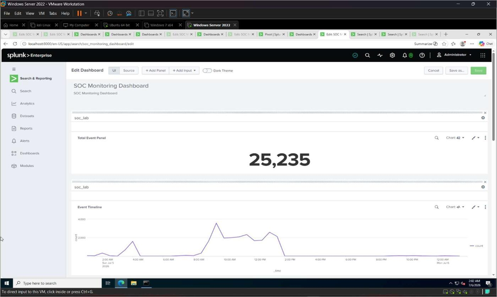
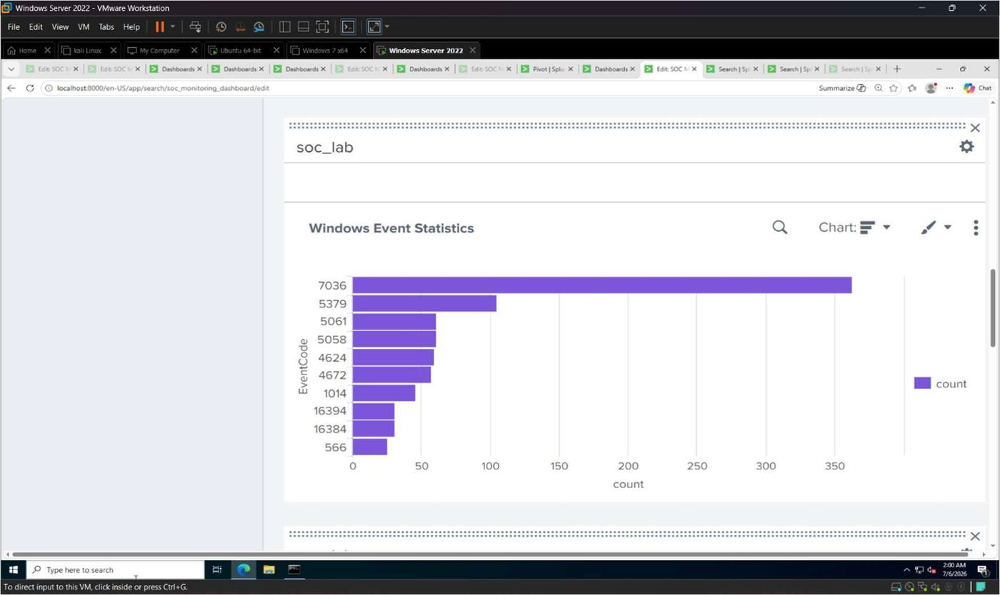
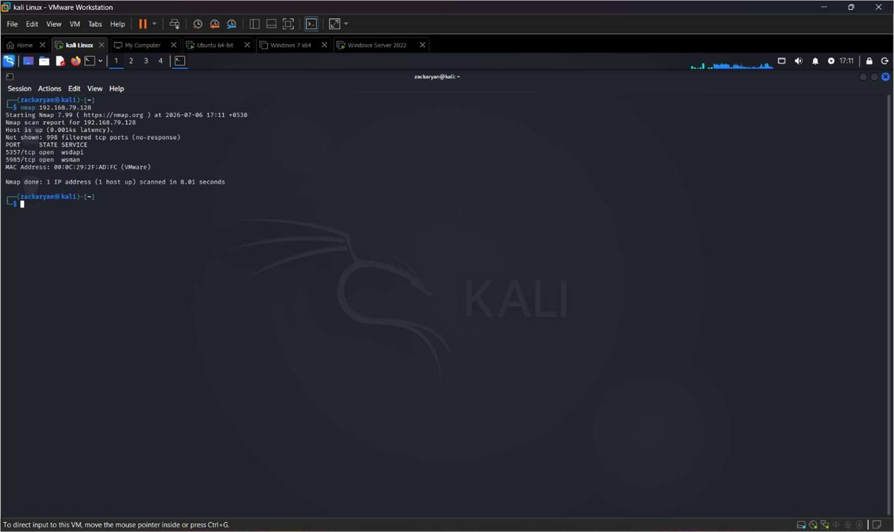
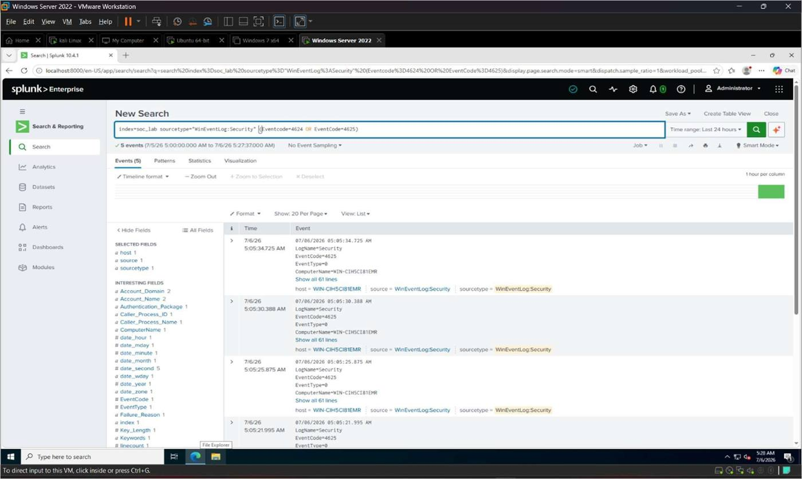

# 🛡️ Splunk SIEM & SOC Monitoring Lab

A complete, hands-on Security Operations Center (SOC) lab built with **Splunk Enterprise** —
covering SIEM deployment, multi-source log collection, dashboarding, attacker simulation, and
SPL-based detection engineering. Built to demonstrate practical, resume-ready skills for
entry-level **SOC Analyst / Blue Team** roles.
---

## 📌 Project Overview

Modern organizations generate massive volumes of security logs from Windows systems, Linux
servers, and firewalls. Without a centralized platform, detecting threats such as brute-force
attacks, privilege escalation, and lateral movement becomes slow and error-prone.

This lab deploys **Splunk Enterprise** inside a virtualized, multi-VM environment to simulate a
small enterprise SOC, covering the full lifecycle of a SIEM project:

1. **Install & configure** Splunk Enterprise and a dedicated `soc_lab` index
2. **Collect** Windows Event Logs (Application/Security/System) via Splunk Universal Forwarder
3. **Collect** Linux Syslog events from Ubuntu via `rsyslog`
4. **Collect** Windows Defender Firewall logs (`pfirewall.log`)
5. **Build** a centralized SOC Monitoring Dashboard (Dashboard Studio)
6. **Simulate attacks** from Kali Linux (recon, port scanning, brute-force login attempts)
7. **Develop detection rules** using SPL to catch the simulated attack patterns
8. **Analyze results**, document troubleshooting, and capture best practices

**Lab topology:**

| Role | System | Purpose |
|---|---|---|
| SIEM | Splunk Enterprise | Central log indexing, search, dashboards, alerting |
| Target / Log Source | Windows Server 2022 | Windows Event Logs, firewall logs |
| Target / Log Source | Ubuntu Linux | Syslog / authentication events (via `rsyslog`) |
| Attacker | Kali Linux | Network scanning and login-attempt simulation |

All events were centralized in a dedicated Splunk index: **`soc_lab`**.

```
                        VMware Workstation
                              │
        ┌─────────────────────┼─────────────────────┐
        │                     │                     │
        ▼                     ▼                     ▼
  Windows Server         Ubuntu Linux           Kali Linux
 (Splunk Enterprise)      (Syslogs)         (Attack Simulation)
        │                     │                     │
        └─────────────────────┼─────────────────────┘
                              │
                              ▼
                      Splunk Enterprise
                              │
              ┌───────────────┼───────────────┐
              ▼               ▼               ▼
       Detection Rules      Alerts        Dashboard
```

---

## 🎯 Objectives

- Build a centralized SIEM laboratory using Splunk Enterprise capable of collecting, indexing,
  monitoring, and analyzing security logs generated by multiple operating systems and network
  devices.
- Set up a multi-VM lab (Windows Server, Ubuntu Linux, Kali Linux).
- Install and configure Splunk Enterprise (free license) and the Splunk Universal Forwarder.
- Collect and verify Windows Event Logs, Linux Syslog, and Windows Defender Firewall logs.
- Analyze logs with SPL — keyword searches, login trend analysis, timecharts, tables, and
  statistical breakdowns.
- Build a centralized SOC Monitoring Dashboard.
- Simulate realistic attacker activity using Kali Linux.
- Develop and validate SPL-based detection rules.
- Document results, troubleshooting, and best practices as a cybersecurity portfolio project.

---

## 🧰 Tools & Technologies

| Category | Tool / Technology |
|---|---|
| SIEM Platform | Splunk Enterprise (Free License) + Dashboard Studio |
| Log Forwarding | Splunk Universal Forwarder, `rsyslog` |
| Virtualization | VMware Workstation |
| Operating Systems | Windows Server 2022, Ubuntu Linux, Kali Linux |
| Query Language | Splunk Search Processing Language (SPL) |
| Log Sources | Windows Event Logs, Linux Syslog (UDP 514), Windows Defender Firewall (`pfirewall.log`) |
| Attack Tools | `nmap`, `ping`, manual login attempts, `logger` |

---

## 📁 Repository Structure

```
splunk-siem-soc-lab/
├── README.md
├── LICENSE
├── .gitignore
├── GITHUB_ABOUT.md                         
└── docs/
    ├── Splunk_SIEM_Lab_Report_Part1.pdf      
    ├── Splunk_SIEM_Lab_Report_Part2.pdf     
    ├── 01-introduction-and-lab-setup.md      # Splunk install, index, forwarder, Win logs
    ├── 02-linux-syslog-collection.md         # rsyslog + Splunk UDP input
    ├── 03-firewall-log-collection.md         # Windows Defender Firewall logging
    ├── 04-dashboard-creation.md              # SOC Monitoring Dashboard (5 panels)
    ├── 05-attack-simulation.md               # Kali Linux recon & brute-force simulation
    ├── 06-detection-rules.md                 # 8 SPL detection rules
    ├── 07-results-and-analysis.md            # Results & effectiveness analysis
    ├── 08-challenges-and-troubleshooting.md  # Issues encountered & fixes
    ├── 09-best-practices.md                  # SOC/Splunk best practices
    ├── 10-conclusion.md                      # Achievements & learning outcomes
    └── Screenshots/                          # 71 sequentially numbered screenshots
```


---

## 🛠️ TOPICS-by-TOPICS Walkthrough

| # | TOPICS | Summary |
|---|---|---|
| 1 | [Introduction & Lab Setup](docs/01-introduction-and-lab-setup.md) | Splunk Enterprise install, `soc_lab` index, Universal Forwarder, Windows Event Log collection & SPL verification |
| 2 | [Linux Syslog Collection](docs/02-linux-syslog-collection.md) | `rsyslog` forwarding, Splunk UDP input (port 514), verification |
| 3 | [Firewall Log Collection](docs/03-firewall-log-collection.md) | Windows Defender Firewall logging, `pfirewall.log` ingestion |
| 4 | [SOC Monitoring Dashboard](docs/04-dashboard-creation.md) | 5-panel dashboard: Total Events, Event Timeline, Windows Stats, Linux Panel, Latest Events table |
| 5 | [Attack Simulation](docs/05-attack-simulation.md) | Kali Linux recon, Nmap scanning, brute-force login simulation |
| 6 | [Detection Rules](docs/06-detection-rules.md) | 8 SPL rules covering failed/successful logins, lockouts, firewall, trends |
| 7 | [Results and Analysis](docs/07-results-and-analysis.md) | Event totals, effectiveness review of dashboards/alerts/rules |
| 8 | [Challenges & Troubleshooting](docs/08-challenges-and-troubleshooting.md) | 5 real issues diagnosed and resolved |
| 9 | [Best Practices](docs/09-best-practices.md) | 9 recommended SOC/Splunk operating practices |
| 10 | [Conclusion](docs/10-conclusion.md) | Achievements & learning outcomes |

---

## 📊 SOC Monitoring Dashboard

| Panel | Visualization | SPL Query |
|---|---|---|
| Total Events | Single Value | `index=soc_lab \| stats count` |
| Event Timeline | Line Chart | `index=soc_lab \| timechart count` |
| Windows Event Statistics | Bar Chart | `index=soc_lab sourcetype="WinEventLog:*" \| top EventCode` |
| Linux Syslog Panel | Column Chart | `index=soc_lab sourcetype=syslog \| stats count by host` |
| Latest Security Events | Table | `index=soc_lab \| table _time host sourcetype source \| sort - _time` |

<p>
  
  
</p>

📄 Full details: [`docs/04-dashboard-creation.md`](docs/04-dashboard-creation.md)

---

## ⚔️ Attack Simulation

Kali Linux was used to simulate realistic attacker behavior against the lab targets:

1. **Network connectivity verification** — `ping <target_ip>`
2. **Port scanning** — `nmap <target_ip>`
3. **Service version detection** — `nmap -sV <target_ip>`
4. **Windows login simulation** — valid/invalid credential attempts (Event Codes `4624`/`4625`)
5. **Linux authentication activity** — `sudo` usage, `logger "SOC Lab Attack Simulation"`

<p>
  
  
</p>

📄 Full details: [`docs/05-attack-simulation.md`](docs/05-attack-simulation.md)

---

## 🔎 Detection Rules

| # | Detection Rule | SPL Query |
|---|---|---|
| 1 | Windows Failed Login Detection | `index=soc_lab EventCode=4625 \| stats count by Account_Name \| where count>=5` |
| 2 | Windows Successful Login Detection | `index=soc_lab EventCode=4624 \| stats count by Account_Name \| where count>=5` |
| 3 | Windows Account Lockout Detection | `index=soc_lab EventCode=4740` |
| 4 | Linux Syslog Detection | `index=soc_lab sourcetype=syslog` |
| 5 | Firewall Log Detection | `index=soc_lab sourcetype=firewall_logs \| stats count by host` |
| 6 | Event Trend Detection | `index=soc_lab \| timechart count` |
| 7 | Top Event Sources | `index=soc_lab \| top host` |
| 8 | Event Distribution by Sourcetype | `index=soc_lab \| stats count by sourcetype` |

📄 Full details: [`docs/06-detection-rules.md`](docs/06-detection-rules.md)

---

## 📈 Results

| Log Source | Sourcetype | Events Collected |
|---|---|---|
| Windows Event Logs | `WinEventLog:*` | 8,487 |
| Linux Syslog | `syslog` | 2,304 |
| Firewall Logs | `firewall_logs` | 66,506 |

📄 Full details: [`docs/07-results-and-analysis.md`](docs/07-results-and-analysis.md)

---

## 🧩 Challenges & Troubleshooting

Five real issues were diagnosed and resolved during the build:

1. VMware NAT network connectivity between VMs.
2. Splunk Universal Forwarder not sending Windows logs.
3. Linux Syslog events not received (rsyslog / UDP 514).
4. Firewall log collection not initially configured.
5. Attack simulation initially generating limited events.

📄 Full details: [`docs/08-challenges-and-troubleshooting.md`](docs/08-challenges-and-troubleshooting.md)

---

## ✅ Best Practices Applied

- Used a dedicated Splunk index (`soc_lab`) instead of the default index.
- Configured reliable forwarding (Universal Forwarder for Windows, `rsyslog` for Linux).
- Reviewed Data Inputs (UDP/TCP/Forwarded) regularly.
- Wrote focused, optimized SPL queries instead of broad searches.
- Configured detection rules/alerts for failed logins, lockouts, and firewall blocks.
- Built a centralized Dashboard Studio dashboard for continuous monitoring.
- Performed regular connectivity, forwarding, and alert testing.
- Kept configuration and troubleshooting steps documented.

📄 Full details: [`docs/09-best-practices.md`](docs/09-best-practices.md)

---

## 🏁 Conclusion & Learning Outcomes

This project provided hands-on experience with core SOC/Blue Team skills:

- Splunk Enterprise installation, configuration, and administration.
- Log collection from Windows (Universal Forwarder) and Linux (`rsyslog`) sources.
- Firewall log integration.
- Writing and optimizing Search Processing Language (SPL) queries.
- Building detection rules and alerts for authentication and network abuse patterns.
- Developing centralized SOC dashboards with Dashboard Studio.
- Using Kali Linux to simulate reconnaissance and brute-force activity.
- Systematic troubleshooting of a multi-VM lab environment.

📄 Full details: [`docs/10-conclusion.md`](docs/10-conclusion.md)

---

## 📚 Full Documentation

The complete, original lab report is included in two parts for reference:

- [`docs/Splunk_SIEM_Lab_Report_Part1.pdf`](docs/Splunk_SIEM_Lab_Report_Part1.pdf) — Chapters 1–13 (setup through the start of the dashboard)
- [`docs/Splunk_SIEM_Lab_Report_Part2.pdf`](docs/Splunk_SIEM_Lab_Report_Part2.pdf) — Chapters 13–19 (dashboard completion through conclusion)

---

## 👤 Author

**Sumit Kumar**
Cybersecurity Student | Aspiring SOC Analyst / Blue Team

---

## 📄 License

This project is released under the [MIT License](LICENSE) — feel free to reference the
structure and approach for your own learning.
