# 1. Introduction & Lab Setup — Splunk Enterprise Installation and Windows Event Log Collection

> Consolidated from the original lab report, Part 1 (Chapters 1–10).

## Introduction

Modern organizations generate massive volumes of security logs from Windows systems, Linux
servers, and firewalls. Without a centralized platform, detecting threats such as brute-force
attacks, privilege escalation, and lateral movement becomes slow and error-prone.

This lab deploys **Splunk Enterprise** inside a virtualized, multi-VM environment to simulate a
small enterprise SOC. It focuses on:

- Installing and configuring Splunk Enterprise
- Deploying the Splunk Universal Forwarder
- Collecting and centralizing **Windows Event Logs** (Application, Security, System)
- Collecting **Linux Syslog** events from an Ubuntu server via `rsyslog`
- Collecting **Windows Defender Firewall logs** (`pfirewall.log`)
- Verifying and analyzing all log sources using Splunk Search Processing Language (SPL) —
  keyword searches, login trend analysis, timecharts, tables, and statistical breakdowns
- Building the panels of a **SOC Monitoring Dashboard**
- Simulating attacker activity from Kali Linux
- Building detection rules and reviewing overall results

## Problem Statement

Organizations generate logs across many disconnected systems — Windows Event Logs, Linux
syslogs, and firewall logs each live in a different format and location. Manually reviewing
thousands of daily log entries makes it easy to miss brute-force attempts, privilege
escalation, or lateral movement until it's too late, and there is no single dashboard for
visibility. This lab addresses that problem by centralizing all logs into Splunk Enterprise as
the foundation for a fully correlated, dashboard-driven SOC monitoring environment.

## Objectives

**Primary Objective**
Build a centralized SIEM laboratory using Splunk Enterprise capable of collecting, indexing,
monitoring, and analyzing security logs generated by multiple operating systems and network
devices.

**Secondary Objectives**
- Set up a multi-VM lab (Windows Server, Ubuntu Linux, Kali Linux)
- Install and configure Splunk Enterprise (free license)
- Configure the Splunk Universal Forwarder for Windows log forwarding
- Verify log ingestion from Windows Event Log channels
- Configure Linux Syslog forwarding from Ubuntu and Windows Defender Firewall log collection
- Analyze all collected logs with SPL — keyword searches, login trend analysis, timecharts, and
  statistical breakdowns
- Build custom SPL-based detection rules (brute-force login attempts, account lockouts,
  firewall activity)
- Simulate attacker activity using Kali Linux
- Build a SOC monitoring dashboard
- Document the implementation as a cybersecurity portfolio project

## Lab Architecture

The lab consists of three virtual machines connected on the same virtual network:

| VM | Role |
|---|---|
| **Windows Server 2022** | Hosts Splunk Enterprise (central SIEM server) |
| **Ubuntu Linux** | Generates Linux syslogs |
| **Kali Linux** | Used to simulate attacker activity |

```
                        VMware Workstation
                              │
        ┌─────────────────────┼─────────────────────┐
        │                     │                     │
        ▼                     ▼                     ▼
  Windows Server         Ubuntu Linux           Kali Linux
 (Splunk Enterprise)      (Syslogs)         (Attack Simulation)
        │                     │                     │
        └─────────────────────┼─────────────────────┘
                              │
                              ▼
                      Splunk Enterprise
                              │
              ┌───────────────┼───────────────┐
              ▼               ▼               ▼
       Detection Rules      Alerts        Dashboard
```

**Workflow:**
1. Windows Server, Ubuntu Linux, and firewall devices generate logs.
2. Logs are collected by Splunk Enterprise.
3. Splunk stores the collected logs in indexes.
4. SPL queries search the logs for suspicious activity.
5. Detection rules generate alerts for suspicious activity.
6. A dashboard displays alerts and security events for monitoring.

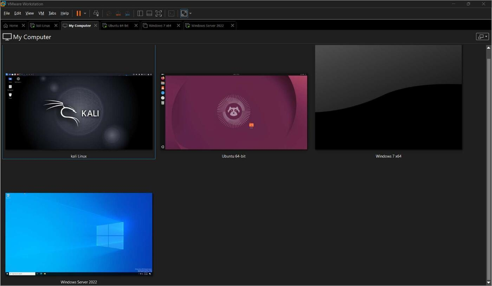
*Figure 1.1 — VMware Workstation showing Windows Server 2022, Ubuntu Linux, and Kali Linux
virtual machines, connected on the same virtual network for centralized log collection.*

## Tools & Technologies

| Category | Tool / Technology |
|---|---|
| SIEM Platform | Splunk Enterprise (Free License) |
| Log Forwarding | Splunk Universal Forwarder |
| Virtualization | VMware Workstation |
| Operating Systems | Windows Server 2022, Ubuntu Linux, Kali Linux |
| Query Language | Splunk Search Processing Language (SPL) |
| Log Sources | Windows Event Logs, Linux Syslogs (rsyslog/UDP 514), Windows Defender Firewall (`pfirewall.log`) |
| Log Shipping | rsyslog (Linux → Splunk UDP input), Splunk Universal Forwarder (Windows) |

---

## 1.1 Installing Splunk Enterprise

Splunk Enterprise was downloaded from the official Splunk website (Windows 64-bit version) and
installed on the Windows Server 2022 VM using default installation settings and a free license.
An administrator account was created during setup, and the Splunk service started automatically
after installation.

The web interface was accessed at:

```
https://localhost:8000
```

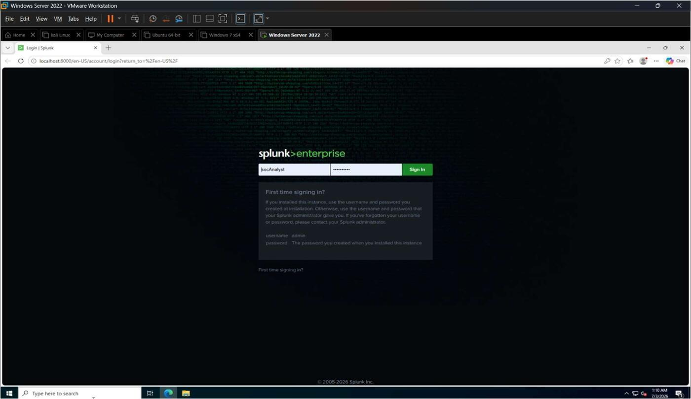
*Figure 1.2 — Splunk Enterprise login page.*

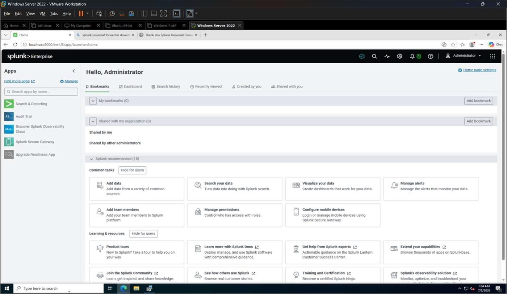
*Figure 1.3 — Splunk Home Dashboard after a successful login, confirming the installation.*

## 1.2 Splunk Configuration — Custom Index

A custom index named **`soc_lab`** was created to keep all project logs organized and separate
from Splunk's default data. This index stores logs collected from Windows Server, Ubuntu Linux,
and firewall sources.

**Benefits of using a dedicated index:**
- Keeps project logs separate from default Splunk data
- Makes searching faster and easier
- Organizes Windows, Linux, and firewall logs in one location
- Simplifies the creation of detection rules and dashboards

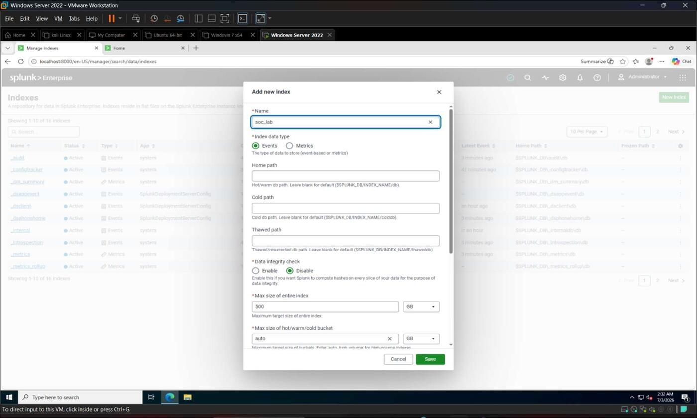
*Figure 1.4 — Creating the `soc_lab` index using default storage settings.*

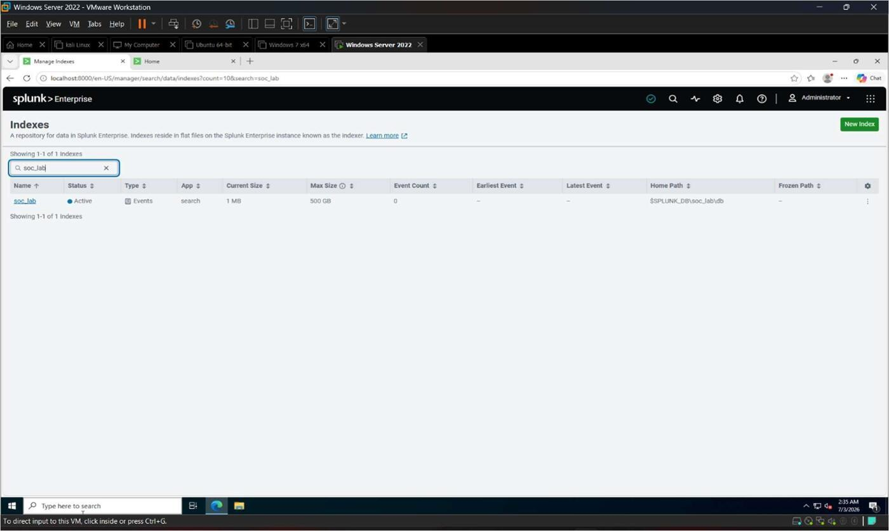
*Figure 1.5 — The `soc_lab` index successfully created and shown as Active in the Indexes list.*

## 1.3 Splunk Universal Forwarder

The Splunk Universal Forwarder was installed on the Windows Server 2022 VM to collect Windows
Event Logs and forward them to the Splunk Enterprise server. During setup, the forwarder was
pointed at the Splunk server using the administrator credentials, and connectivity was verified.

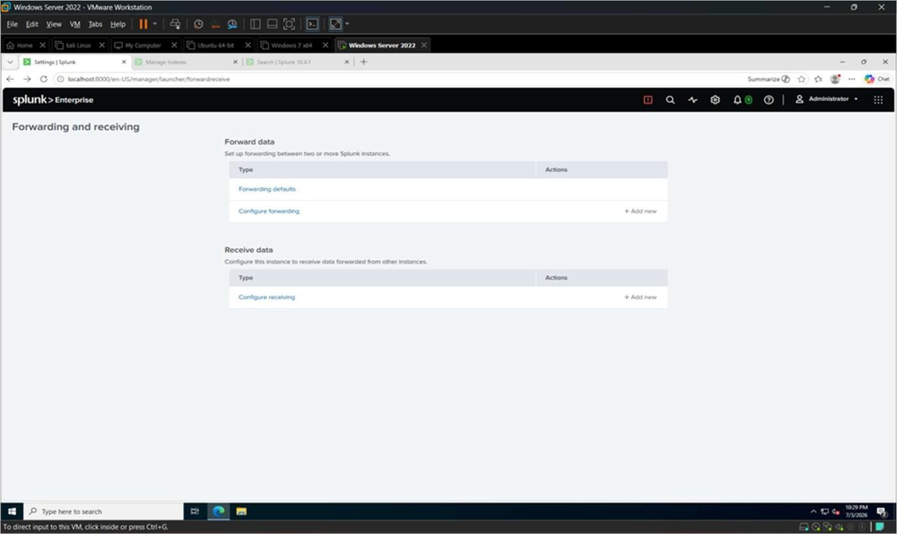
*Figure 1.6 — The Forwarding and Receiving settings page in Splunk, used to configure data
inputs from the Universal Forwarder.*

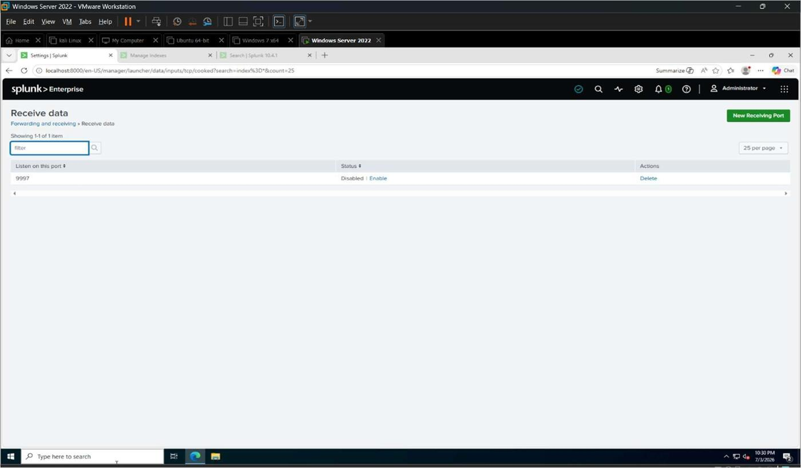
*Figure 1.7 — Receiving port 9997 configured on the Splunk Enterprise server to accept
forwarded data.*

Connectivity between the Universal Forwarder and the Splunk Enterprise server was verified
using PowerShell:

```powershell
Test-NetConnection 192.168.79.128 -Port 9997
```

**Output:**
```
Remote Address    : 192.168.79.128
Remote Port       : 9997
TcpTestSucceeded  : True
```

Once the connection was confirmed, Windows Event Logs began appearing in the `soc_lab` index,
confirming that the Universal Forwarder was working correctly.

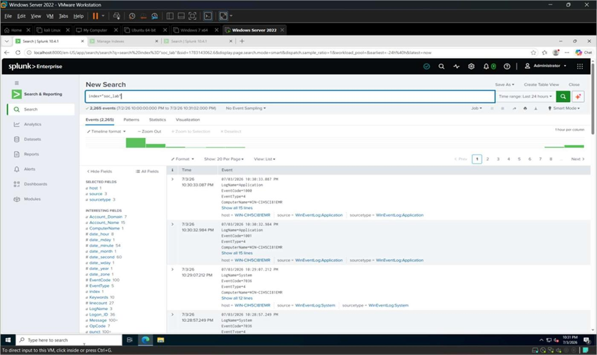
*Figure 1.8 — Verifying that Windows Event Logs are being received in the `soc_lab` index via
Search & Reporting.*

## 1.4 Windows Event Log Collection

The Splunk Universal Forwarder was configured to collect three Windows Event Log channels and
forward them into the `soc_lab` index:

- **Application**
- **Security**
- **System**

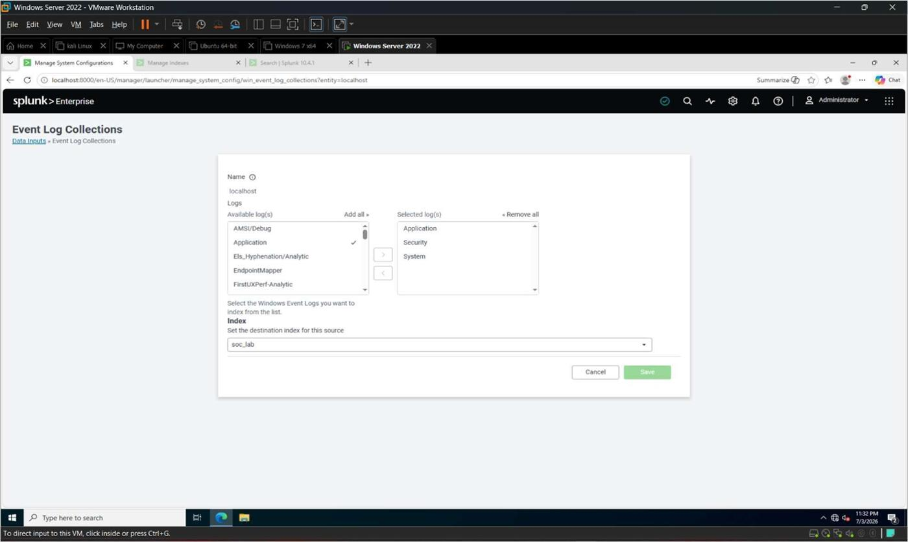
*Figure 1.9 — Windows Event Log input configuration showing Application, Security, and System
channels selected, with `soc_lab` set as the destination index.*

### Verifying Log Collection

The following base SPL query was used to confirm that logs were arriving in the index:

```spl
index=soc_lab
```

The collected events exposed useful fields for investigation, including:

| Field | Description |
|---|---|
| Event Time | Timestamp of the event |
| Event Code | Windows Event ID |
| Log Name | Source log channel (Application / Security / System) |
| Host Name | Originating computer name |
| Source | Log source path |
| Source type | Splunk sourcetype classification |

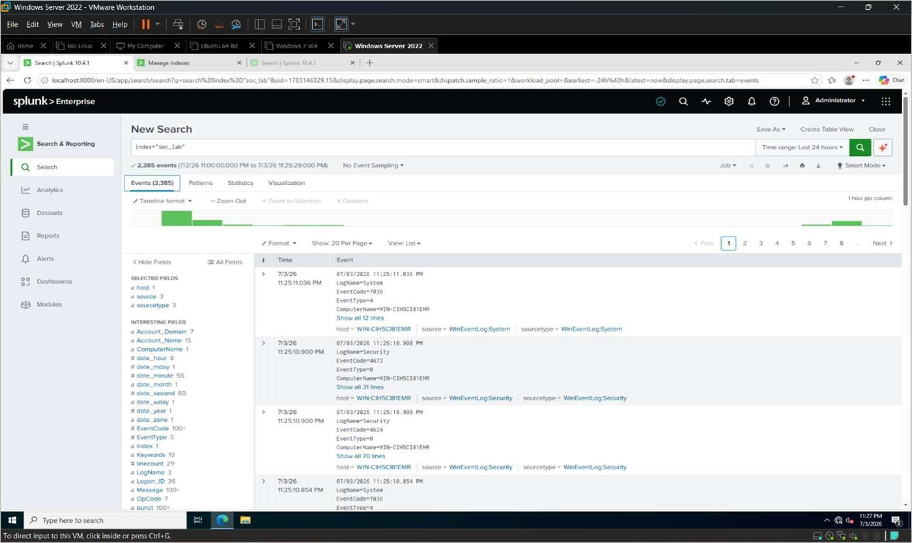
*Figure 1.10 — An expanded Windows System event (Event Code 7036) showing Host Name, Source,
and Source type — the fields used by analysts to investigate system activity.*

### Verifying Each Log Channel Individually

**Application Logs**
```spl
index=soc_lab sourcetype="WinEventLog:Application"
```
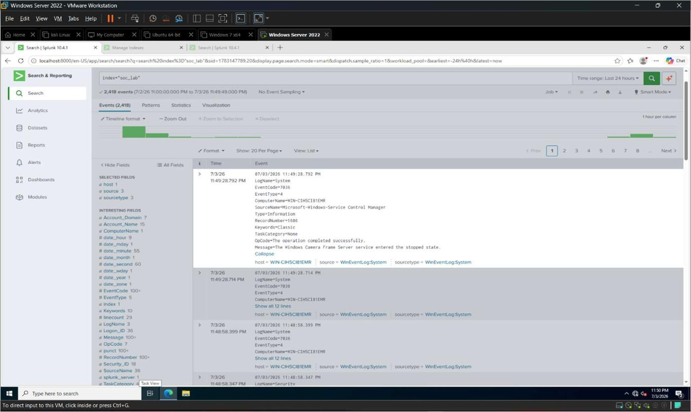
*Figure 1.11 — Application-related events generated by the Windows Server.*

**Security Logs**
```spl
index=soc_lab sourcetype="WinEventLog:Security"
```

*Figure 1.12 — Windows Security events, including login and authentication activity — the
foundation for future brute-force and privilege escalation detection rules.*

**System Logs**
```spl
index=soc_lab sourcetype="WinEventLog:System"
```
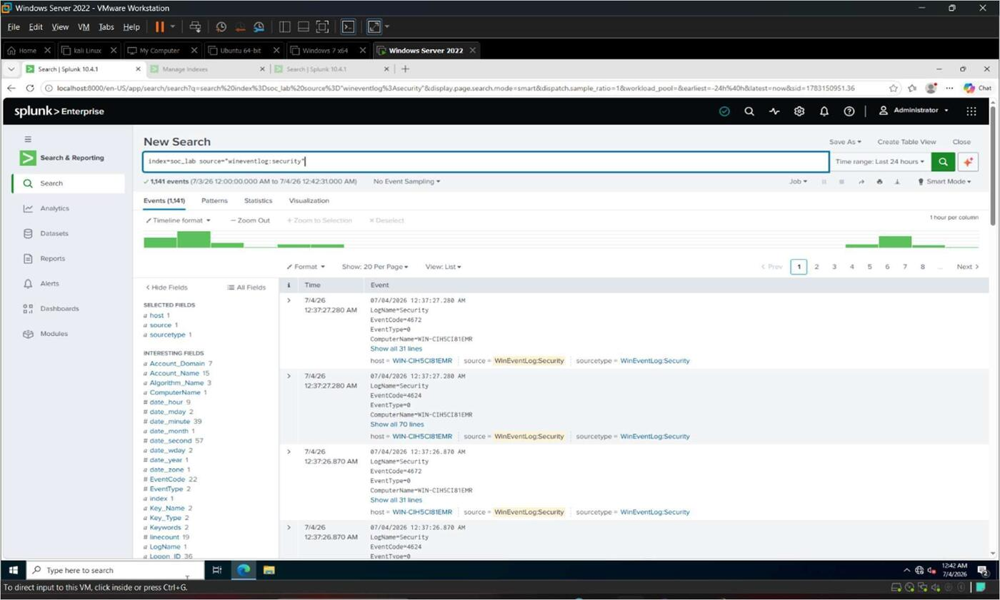
*Figure 1.13 — Windows System events successfully forwarded and indexed.*

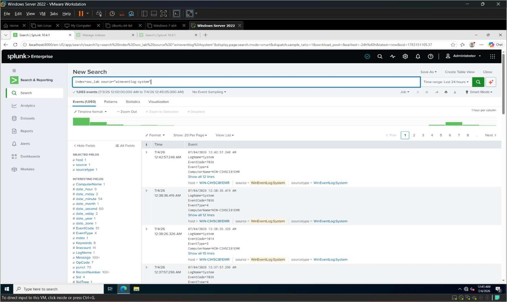
*Figure 1.14 — Additional confirmation of System event logs in the `soc_lab` index.*

### Verifying All Windows Event Log Categories Together

```spl
index=soc_lab sourcetype="WinEventLog:*"
```

This wildcard query displayed all Windows Event Log categories (Application, Security, System)
available in the project in a single view.

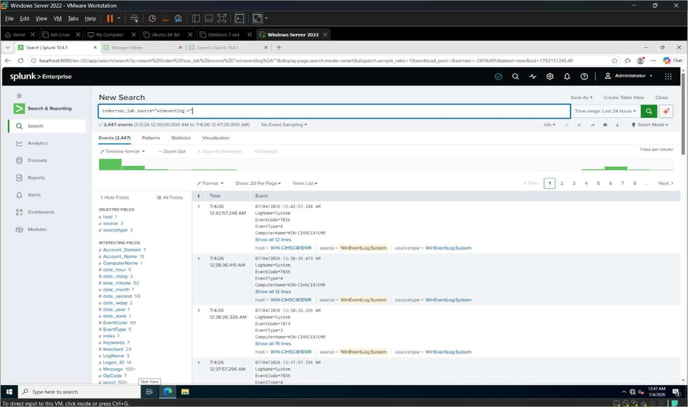
*Figure 1.15 — All Windows Event Log categories returned by a single wildcard `sourcetype`
query.*

### Additional SPL Verification Tasks

A series of follow-up SPL tasks were run against the `soc_lab` index to practice core Splunk
search, statistics, and visualization operations:

**Count total events**
```spl
index=soc_lab | stats count
```
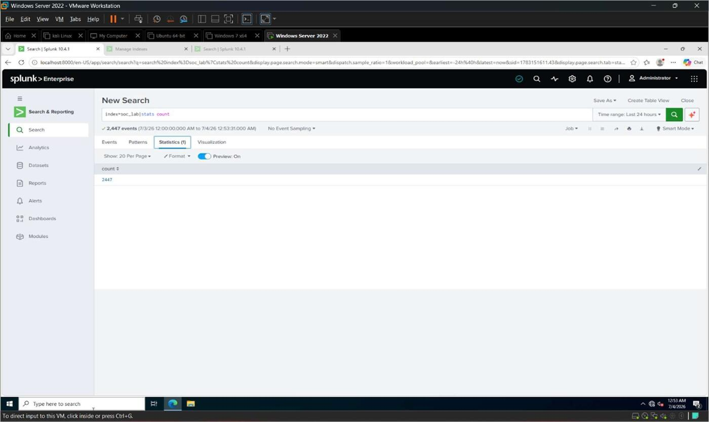
*Figure 1.16*

**View latest events first**
```spl
index=soc_lab | sort - _time
```

*Figure 1.17*

**Search logs using a keyword** (e.g. `error`)
```spl
index=soc_lab error
```
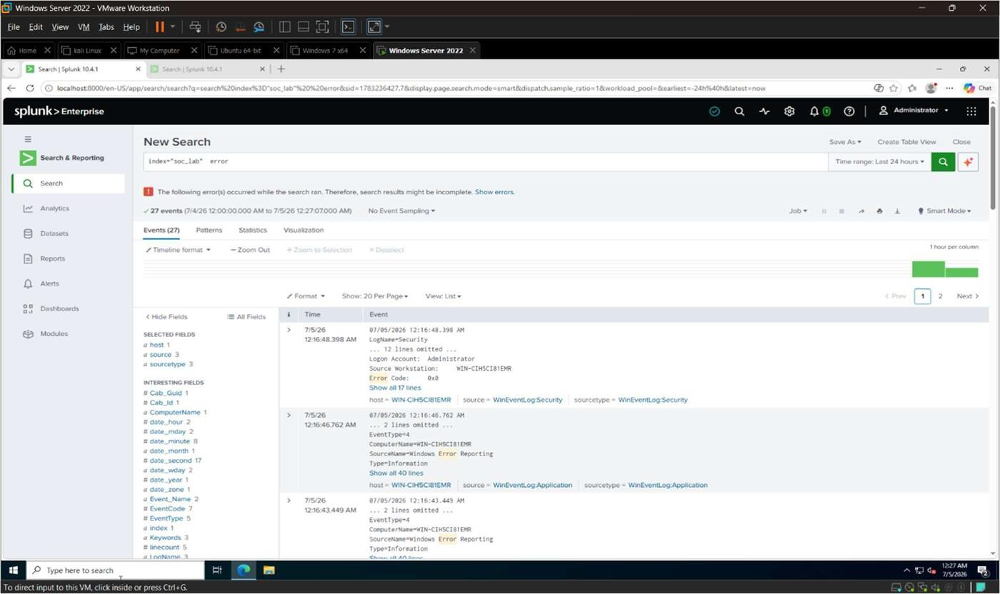
*Figure 1.18*

**Successful login trend** (Event Code 4624)
```spl
index=soc_lab EventCode=4624
| timechart count
```
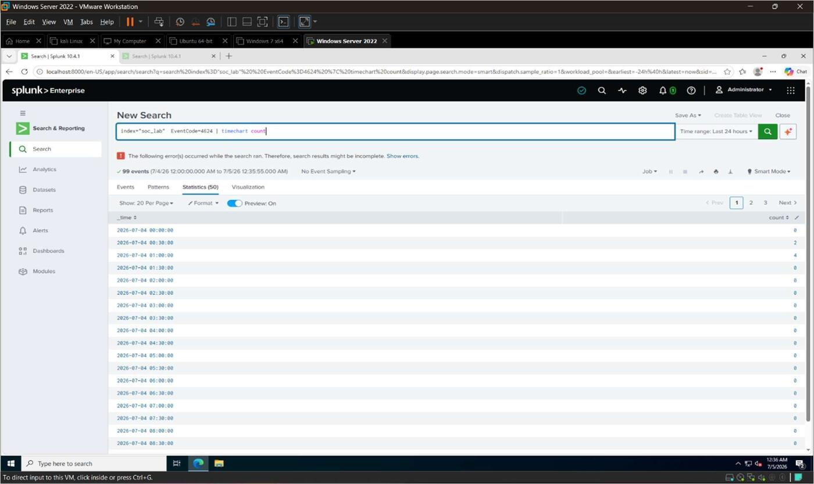
*Figure 1.19*

**Failed login trend** (Event Code 4625)
```spl
index=soc_lab EventCode=4625
| timechart count
```
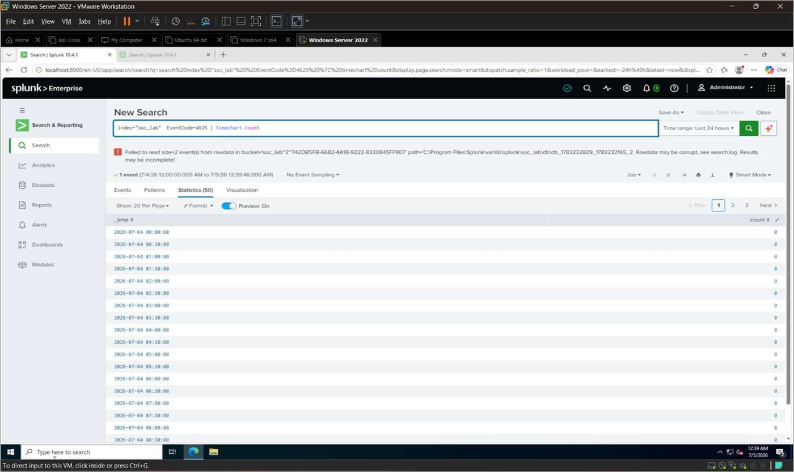
*Figure 1.20*

**Event activity timeline**
```spl
index=soc_lab | timechart count
```
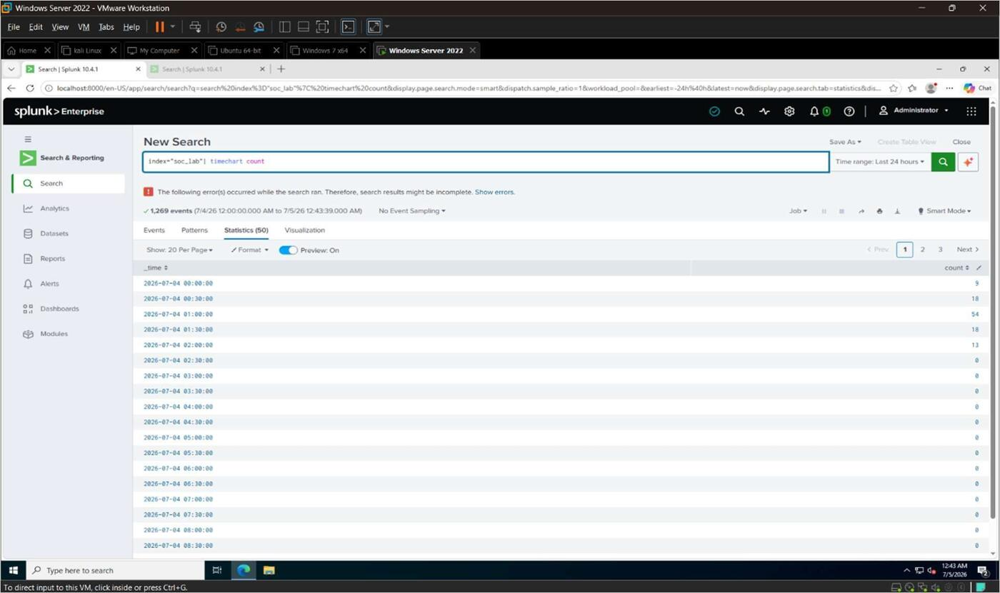
*Figure 1.21*

**Display logs in table format**
```spl
index=soc_lab | table _time host EventCode sourcetype
```
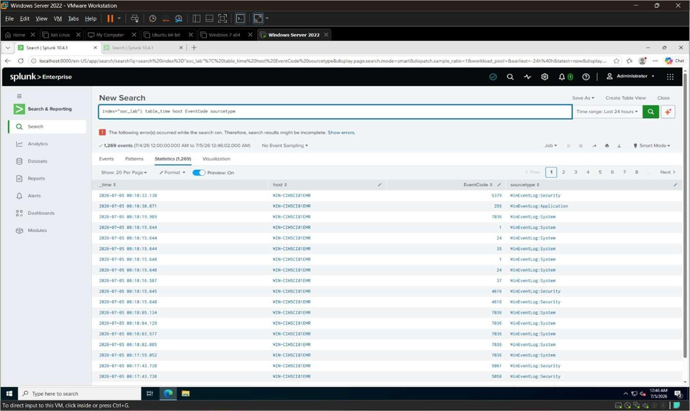
*Figure 1.22*

**Display top Event Codes**
```spl
index=soc_lab | top EventCode
```
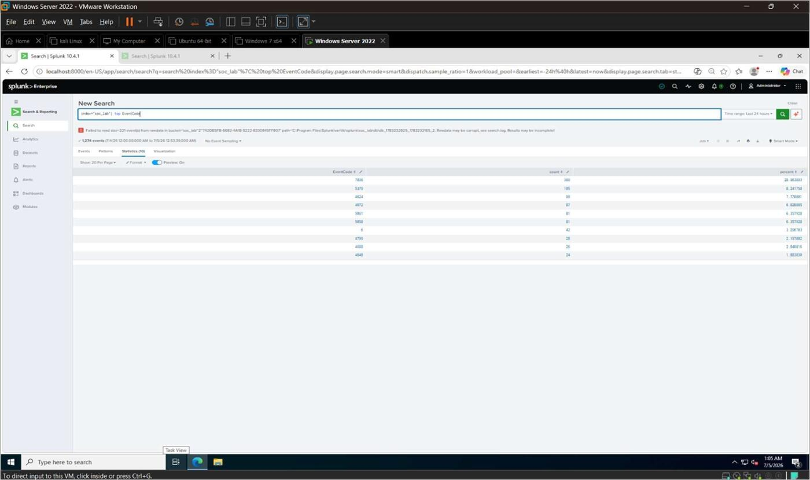
*Figure 1.23*

**Count events by sourcetype**
```spl
index=soc_lab | stats count by sourcetype
```
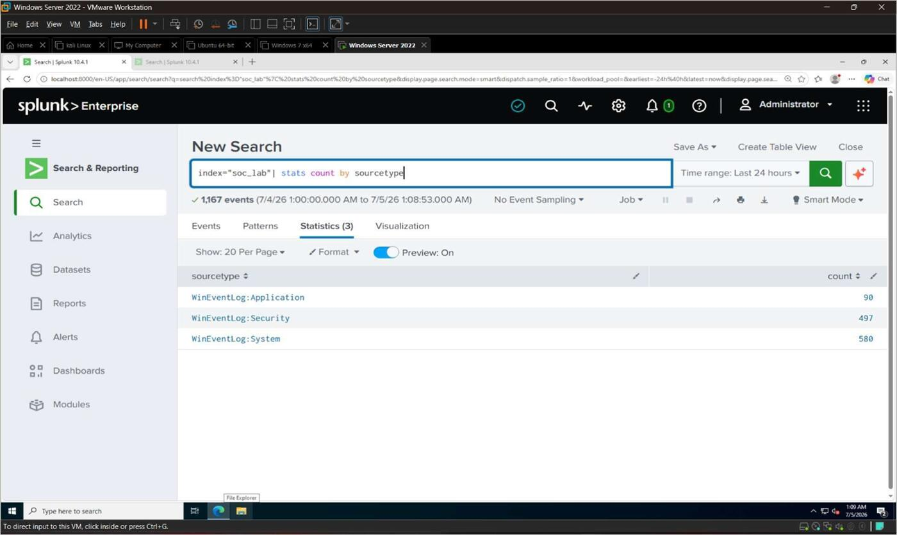
*Figure 1.24 — Breakdown of collected events by sourcetype — `WinEventLog:Application` (90),
`WinEventLog:Security` (497), and `WinEventLog:System` (580).*

## Tasks Performed

- Installed Splunk Enterprise and verified access via the web interface.
- Created the dedicated `soc_lab` index.
- Installed and verified the Splunk Universal Forwarder.
- Configured Windows Event Log collection (Application, Security, System).
- Forwarded logs to the `soc_lab` index.
- Verified successful log collection using Splunk Search — including keyword search,
  login-trend analysis, timecharts, tables, and statistical breakdowns.

## Summary

Splunk Enterprise was successfully installed and configured with a dedicated `soc_lab` index.
The Splunk Universal Forwarder was deployed on Windows Server 2022 to collect Application,
Security, and System Event Logs, and connectivity and log ingestion were verified. Multiple SPL
queries confirmed that Windows Event Logs were being reliably centralized in Splunk, laying the
foundation for Linux Syslog and Firewall log collection in the following chapters.
