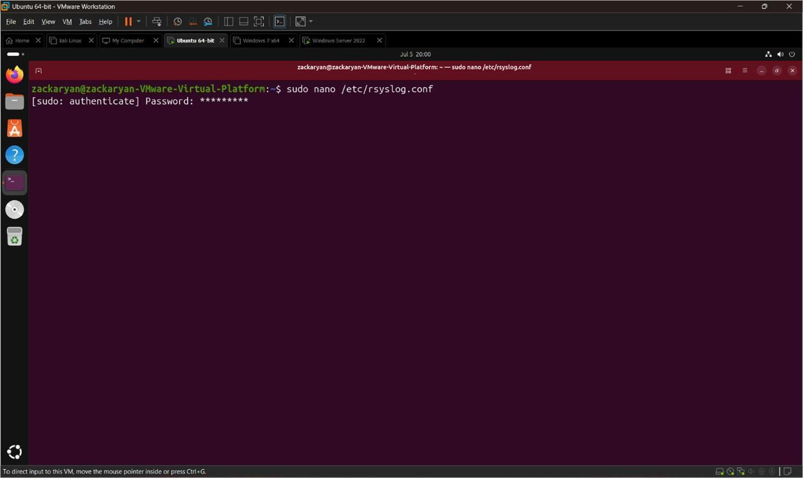
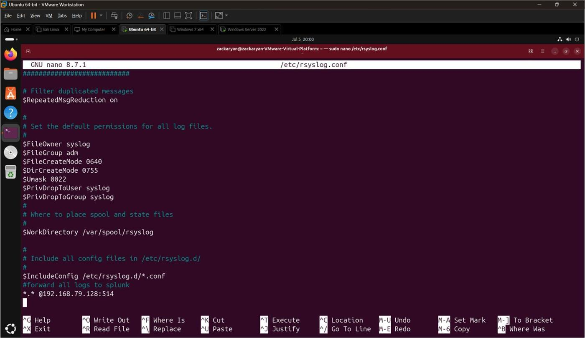
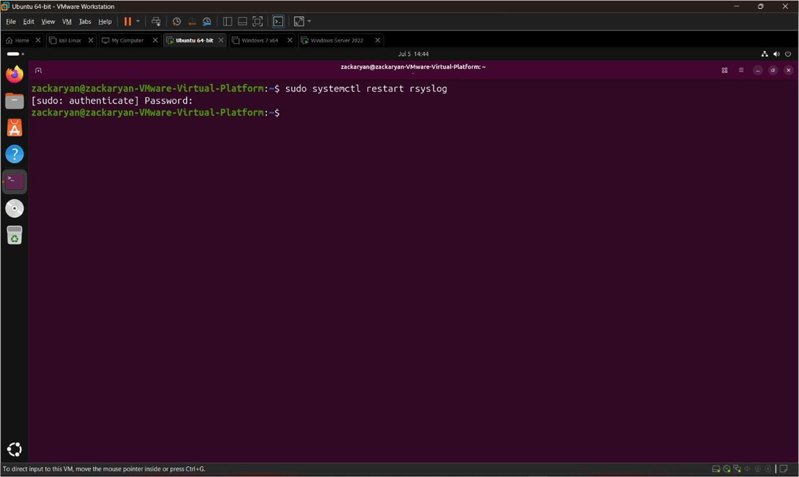
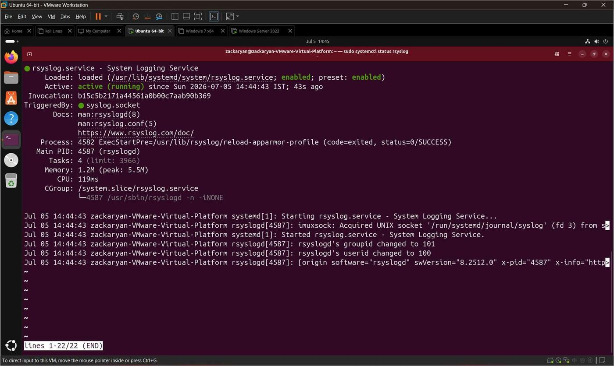
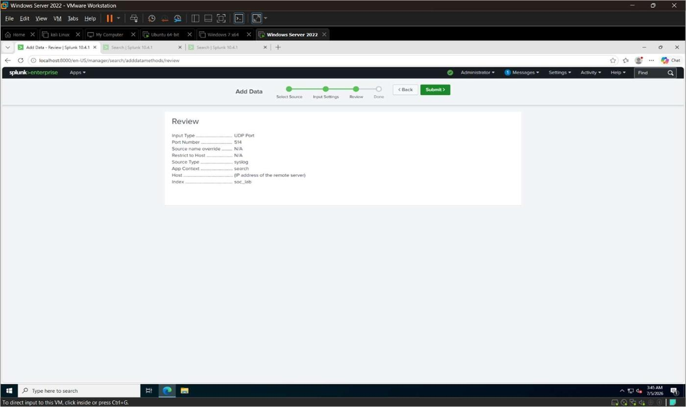
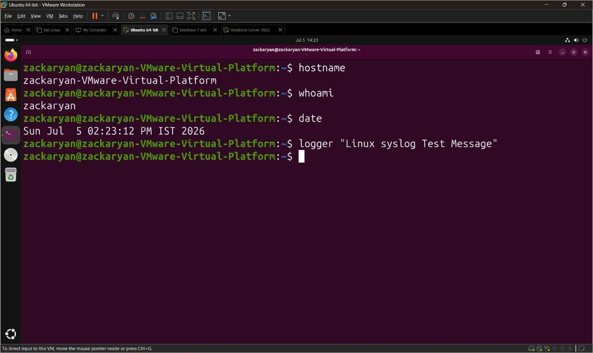
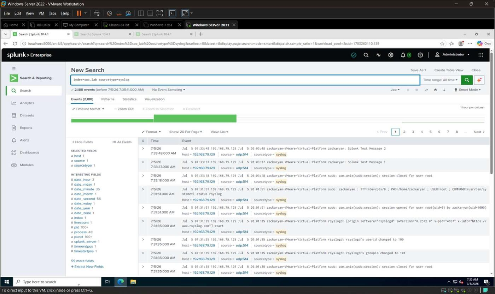
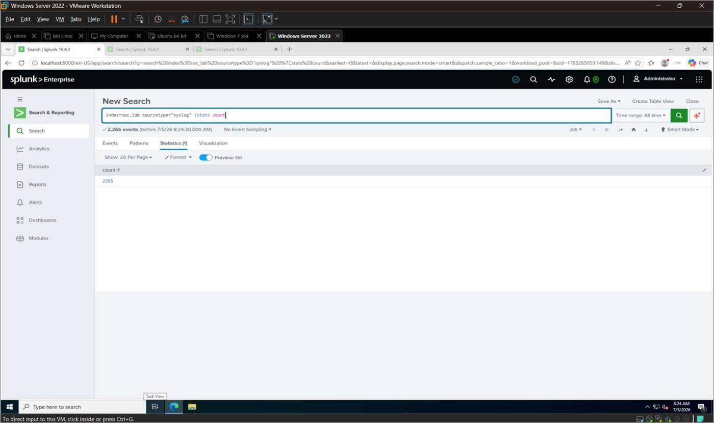
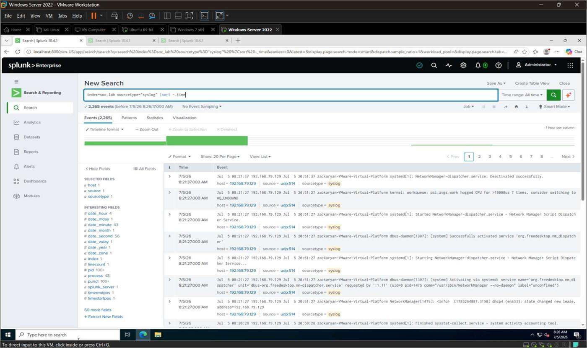

# 2. Linux Syslog Collection

Linux Syslog collection was configured to send system logs from the Ubuntu virtual machine to
Splunk Enterprise. Syslog is a standard logging service used in Linux to record system
activities, authentication events, and service messages — collecting these logs in Splunk
enables monitoring Linux systems from the same single dashboard as Windows and firewall data.

## Objectives

- Configure Ubuntu to send Syslog logs
- Configure Splunk Enterprise to receive Linux logs
- Verify Linux logs in the `soc_lab` index
- Analyze Linux Syslog events using SPL queries

## 2.1 Configure Syslog Forwarding on Ubuntu

The Ubuntu VM's `rsyslog` configuration was edited to forward all logs to the Splunk server:

```bash
sudo nano /etc/rsyslog.conf
```


*Figure 2.1*

The following forwarding line was added to the end of the file:

```
*.* @<Splunk_Server_IP>:514
```


*Figure 2.2 — `/etc/rsyslog.conf` showing the forwarding rule `*.* @192.168.79.128:514` added at
the end of the file.*

The service was then restarted and its status verified:

```bash
sudo systemctl restart rsyslog
sudo systemctl status rsyslog
```

**Expected output:** `Active: active (running)`


*Figure 2.3*


*Figure 2.4 — `rsyslog.service` confirmed active and running after restart.*

## 2.2 Configure UDP Input in Splunk

To receive Linux Syslog events, a UDP data input was created in Splunk Enterprise:

| Setting | Value |
|---|---|
| Port Number | 514 |
| Source Type | `syslog` |
| Index | `soc_lab` |


*Figure 2.5 — Review screen confirming the UDP Port 514 input, sourcetype `syslog`, and
destination index `soc_lab`.*

## 2.3 Generate Test Logs

Basic Linux commands were run on Ubuntu to generate fresh Syslog events for verification:

```bash
hostname
whoami
date
logger "Linux Syslog Test Message"
```


*Figure 2.6*

## 2.4 Verify Linux Logs

```spl
index=soc_lab sourcetype=syslog
```

*Figure 2.7 — Linux Syslog events (e.g. `sudo`, `rsyslogd`, PAM session messages) successfully
arriving in the `soc_lab` index.*

## 2.5 Count Linux Events

```spl
index=soc_lab sourcetype=syslog
| stats count
```

*Figure 2.8*

## 2.6 View Latest Linux Logs

```spl
index=soc_lab sourcetype=syslog
| sort - _time
```

*Figure 2.9*

## Tasks Performed

- Configured Syslog forwarding on Ubuntu.
- Configured UDP input in Splunk Enterprise.
- Generated Linux test logs.
- Verified Linux Syslog events, counted them, and reviewed the latest entries.

## Summary

Ubuntu Linux was successfully configured to send Syslog logs to Splunk Enterprise. The logs
were received in the `soc_lab` index and verified using SPL queries, enabling centralized
monitoring of Linux system logs within the SIEM lab.
