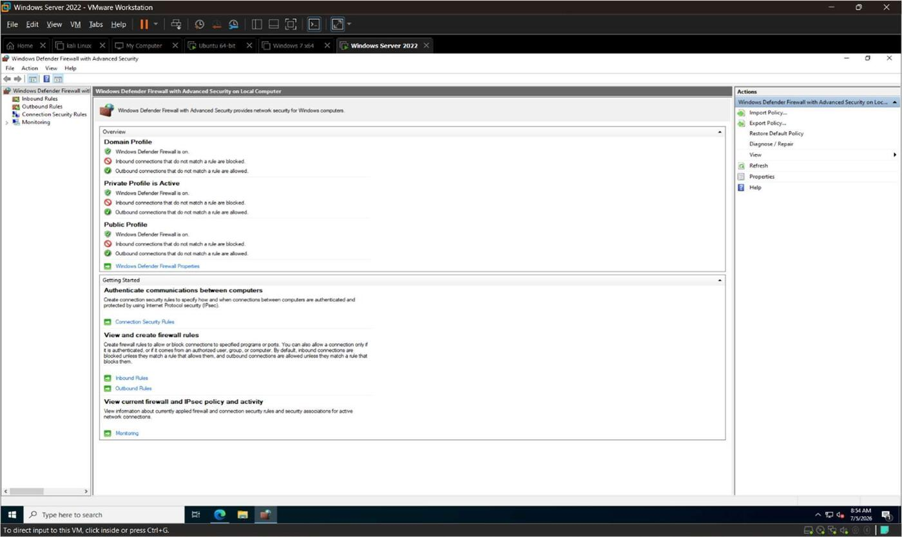
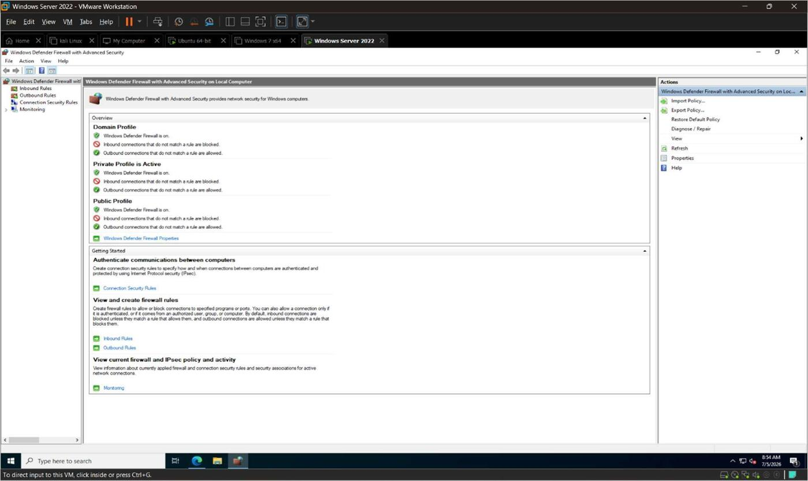
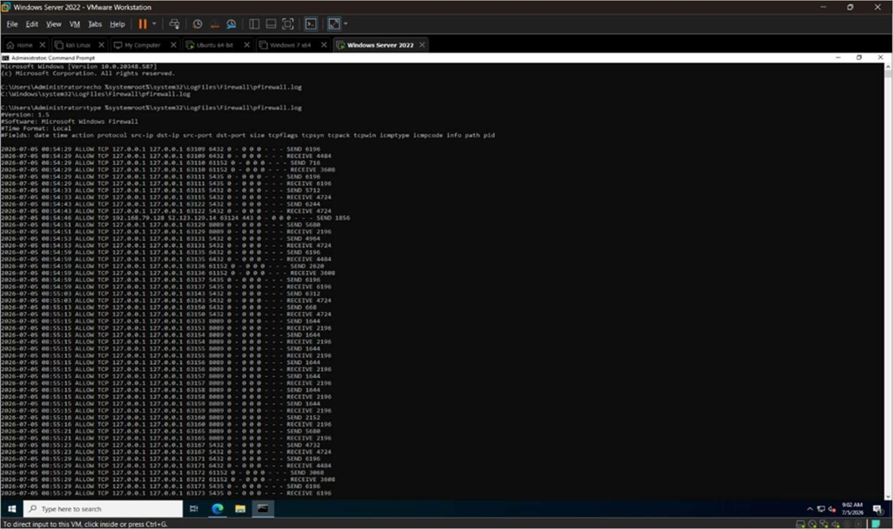
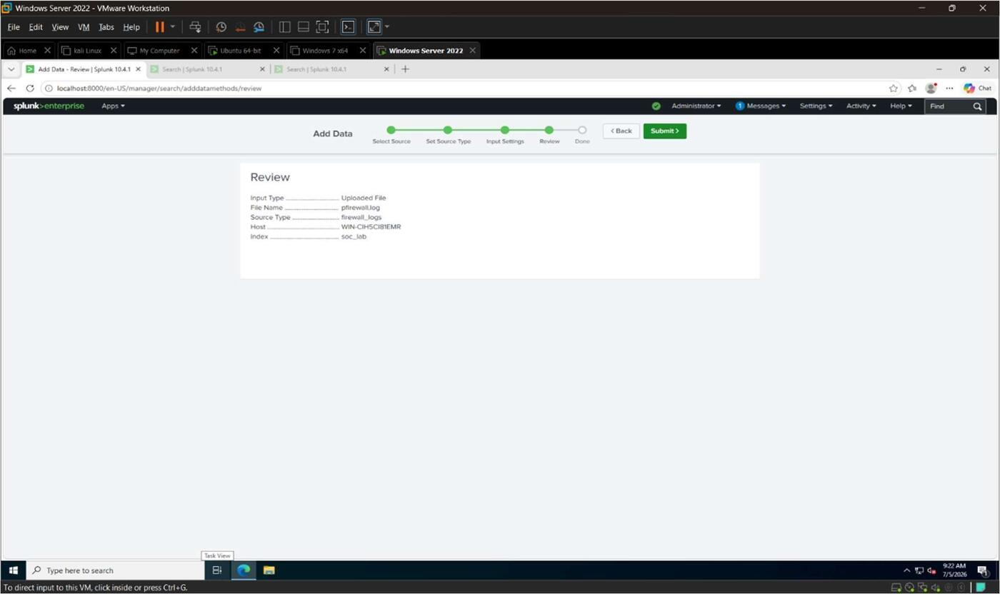
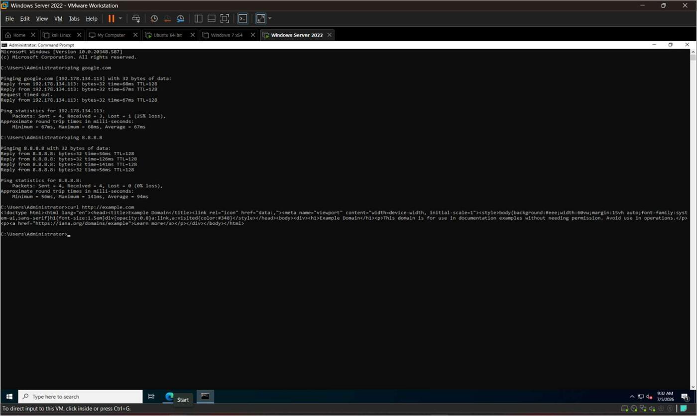
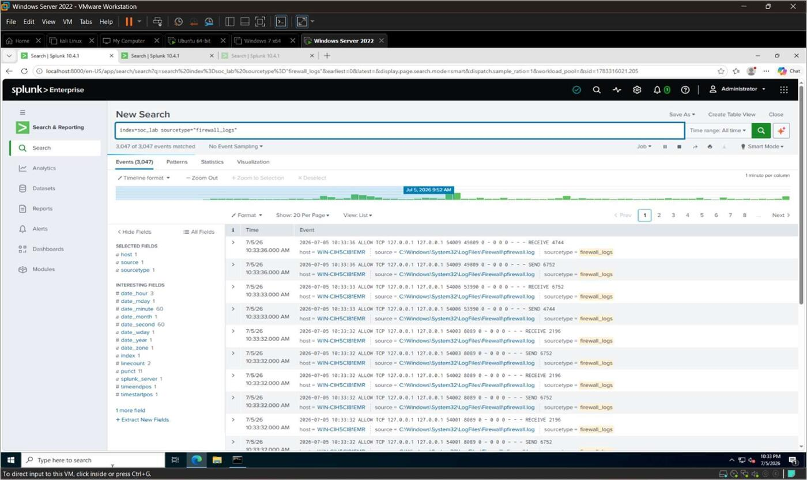
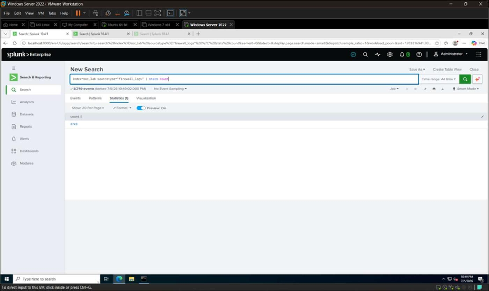
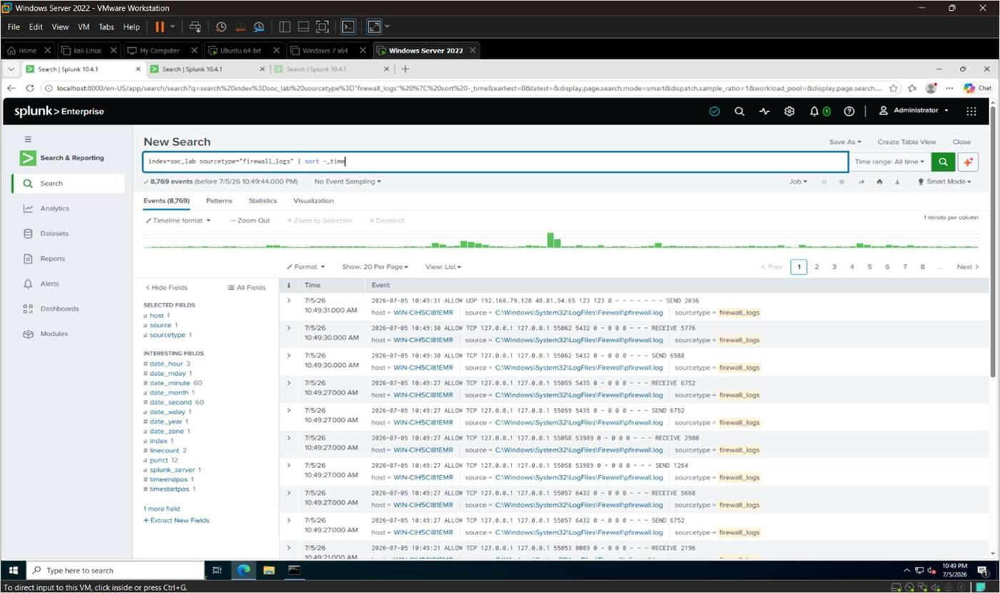
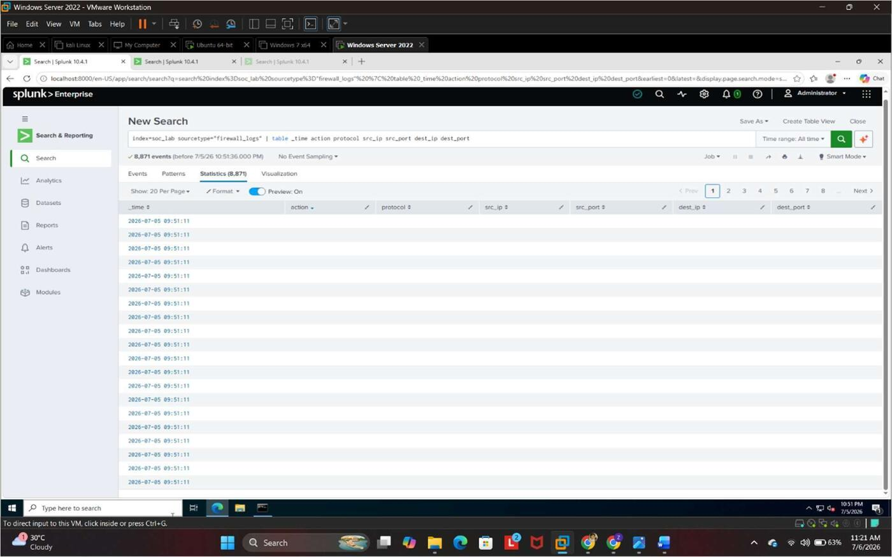
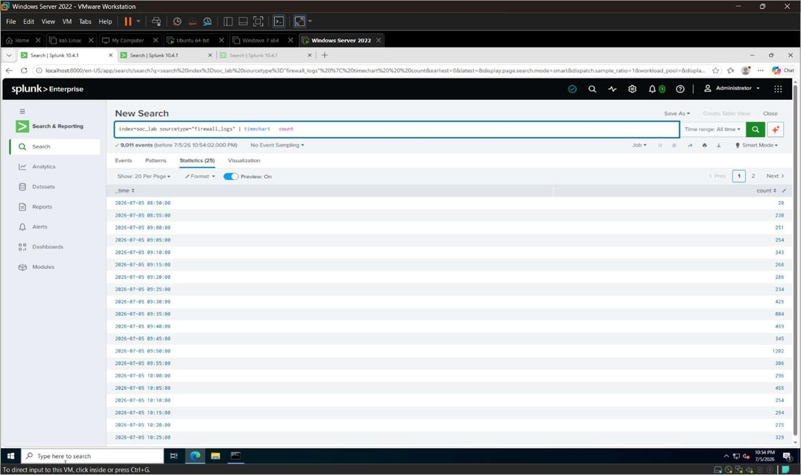

# 3. Firewall Log Collection

Firewall logs provide detailed information about network traffic entering and leaving a system
— allowed connections, blocked packets, source/destination IPs, protocols, ports, and other
network activity. In a SOC, firewall logs are an important source for detecting suspicious
network behavior and investigating incidents.

In this project, **Windows Defender Firewall logging** was enabled on the Windows Server 2022
VM, and the generated log file was collected into Splunk Enterprise.

## Objectives

- Enable Windows Defender Firewall logging
- Collect firewall log files into Splunk Enterprise
- Verify successful firewall log collection
- Analyze firewall events using SPL queries

## Lab Environment

| Component | Configuration |
|---|---|
| Hypervisor | VMware Workstation |
| Operating System | Windows Server 2022 |
| SIEM Platform | Splunk Enterprise |
| Firewall | Windows Defender Firewall |
| Log Source | `pfirewall.log` |
| Index | `soc_lab` |

## 3.1 Enable Windows Defender Firewall Logging

**Steps:**
1. Open **Run** and execute `wf.msc`
2. Select **Windows Defender Firewall Properties**
3. Open the active firewall profile (Private/Public/Domain) → click **Customize...** under the
   Logging section
4. Configure:
   - Log dropped packets: **Yes**
   - Log successful connections: **Yes**
   - Maximum log size: **32767 KB**
5. Click **OK** to save


*Figure 3.1 — Windows Defender Firewall with Advanced Security console.*


*Figure 3.2 — Firewall profile logging settings configured to log both dropped and successful
connections.*

## 3.2 Verify the Firewall Log File

```cmd
echo %systemroot%\System32\LogFiles\Firewall\pfirewall.log
type %systemroot%\System32\LogFiles\Firewall\pfirewall.log
```


*Figure 3.3 — Contents of `pfirewall.log`, showing fields such as date, time, action, protocol,
source/destination IP, and port.*

## 3.3 Configure Splunk to Collect Firewall Logs

**Navigate to:** `Settings → Add Data → Files & Directories`, then browse to:

```
C:\Windows\System32\LogFiles\Firewall\pfirewall.log
```

| Setting | Value |
|---|---|
| Source Type | `firewall_logs` |
| Index | `soc_lab` |


*Figure 3.4 — Review screen confirming `pfirewall.log` added as a new Splunk data input with
sourcetype `firewall_logs`.*

## 3.4 Generate Firewall Events

Network traffic was generated from the Windows Server to populate the firewall log:

```cmd
ping google.com
ping 8.8.8.8
curl http://example.com
```


*Figure 3.5*

## 3.5 Verify Firewall Logs in Splunk

```spl
index=soc_lab sourcetype=firewall_logs
```

*Figure 3.6 — Firewall events successfully indexed and searchable in Splunk.*

## 3.6 Count Firewall Events

```spl
index=soc_lab sourcetype=firewall_logs
| stats count
```

*Figure 3.7*

## 3.7 View Latest Firewall Events

```spl
index=soc_lab sourcetype=firewall_logs
| sort - _time
```

*Figure 3.8*

## 3.8 Display Firewall Logs in Table Format

```spl
index=soc_lab sourcetype=firewall_logs
| table _time action protocol src_ip src_port dest_ip dest_port
```

*Figure 3.9*

## 3.9 Firewall Event Timeline

```spl
index=soc_lab sourcetype=firewall_logs
| timechart count
```

*Figure 3.10*

## Tasks Performed

- Enabled Windows Defender Firewall logging and verified the log file location.
- Configured Splunk Enterprise to collect firewall logs.
- Generated network traffic to create firewall events.
- Verified, counted, tabulated, and charted firewall events in Splunk.

## Summary

Windows Defender Firewall logging was successfully enabled and the firewall log file was
collected into Splunk Enterprise. The collected firewall events were stored in the `soc_lab`
index and verified using multiple SPL queries. These logs supported the dashboard, attack
simulation, and detection rule work carried out in the following chapters.
