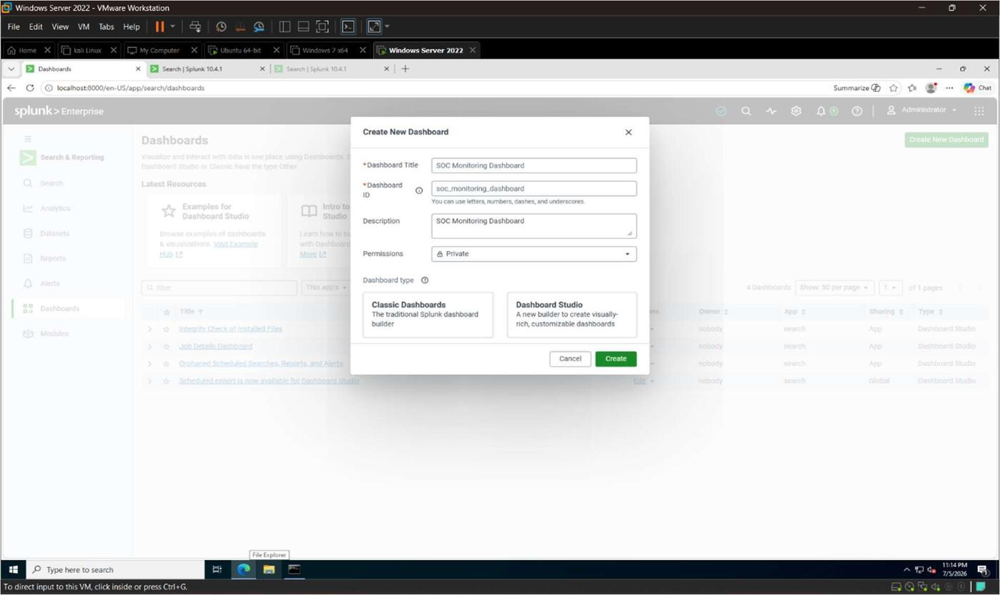
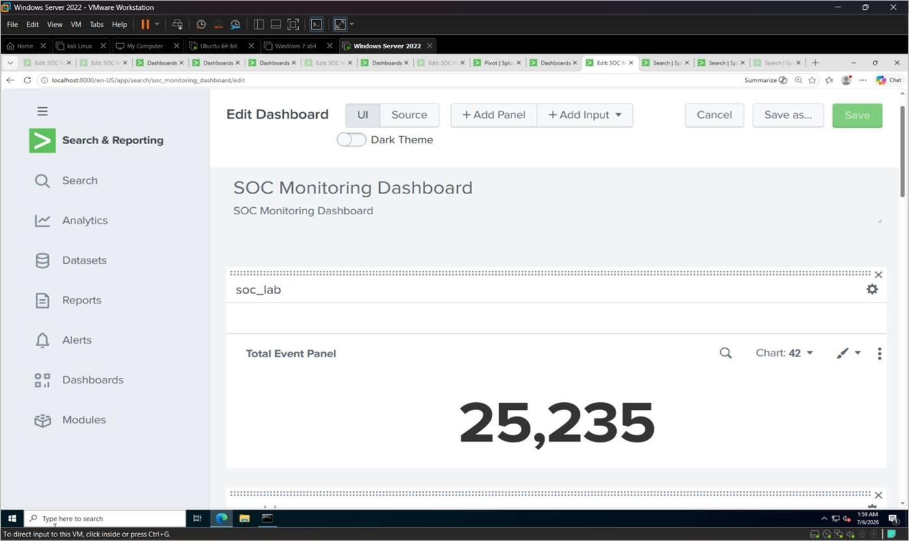
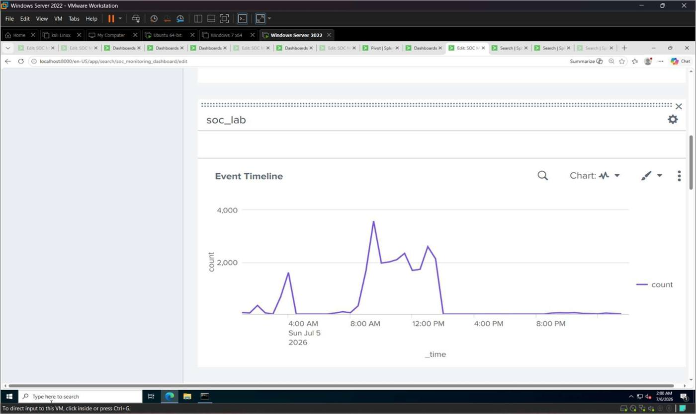
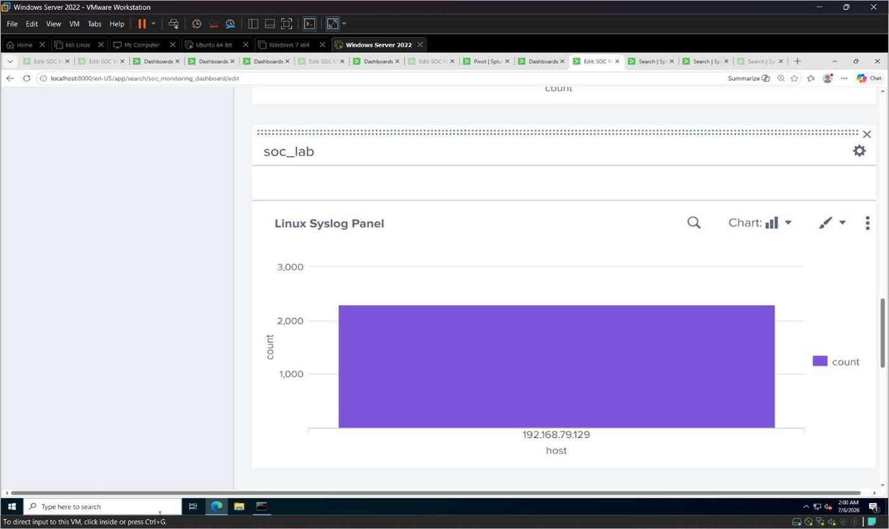
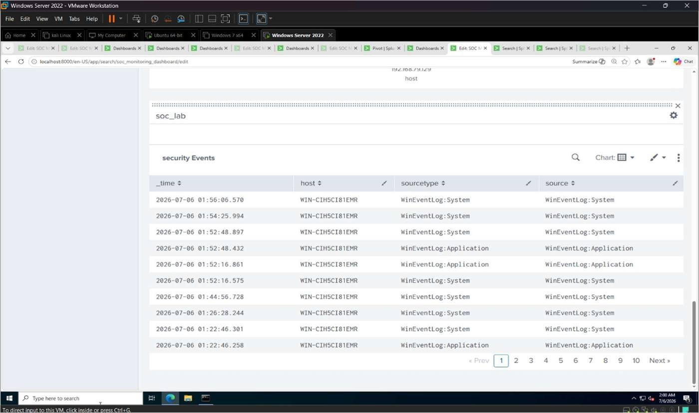

# 4. SOC Monitoring Dashboard (Splunk Dashboard Studio)

After collecting Windows Event Logs, Linux Syslogs, and Firewall logs into Splunk Enterprise,
the next step is to visualize the collected security events using dashboards. Dashboards give
SOC analysts a centralized view of security events, allowing them to monitor system activity,
identify trends, and quickly detect suspicious behavior.

A custom Splunk dashboard — the **SOC Monitoring Dashboard** — was created using the `soc_lab`
index, combining event statistics, charts, and tables from Windows, Linux, and Firewall log
data into a single monitoring view, built with **Splunk Dashboard Studio**.

## Objectives

- Create a custom Splunk dashboard.
- Add panels using SPL queries.
- Visualize Windows, Linux, and Firewall events.
- Monitor security events using dashboard visualizations.

## 4.1 Create a New Dashboard

**Navigate to:** `Dashboards → Create New Dashboard`

| Setting | Value |
|---|---|
| Dashboard Name | SOC Monitoring Dashboard |
| Dashboard ID | `soc_monitoring_dashboard` |
| Permissions | Private |


*Figure 4.1*

## 4.2 Panel 1 — Total Events

```spl
index=soc_lab
| stats count
```

**Visualization:** Single Value


*Figure 4.2 — The Total Event Panel configured as a Single Value visualization.*

## 4.3 Panel 2 — Event Timeline

```spl
index=soc_lab
| timechart count
```

**Visualization:** Line Chart


*Figure 4.3 — The SOC Monitoring Dashboard showing the Total Event Panel (25,235 events)
alongside the Event Timeline line chart.*


*Figure 4.4 — The Event Timeline panel, showing overall event volume across the environment
over time (peaks correspond to periods of attack-simulation activity, covered in Chapter 5).*

## 4.4 Panel 3 — Windows Event Statistics

Displays the most common Windows Event Codes collected in the lab.

```spl
index=soc_lab sourcetype="WinEventLog:*"
| top EventCode
```

**Visualization:** Bar Chart


*Figure 4.5*

## 4.5 Panel 4 — Linux Syslog Panel

Displays Linux Syslog events grouped by host.

```spl
index=soc_lab sourcetype=syslog
| stats count by host
```

**Visualization:** Column Chart


*Figure 4.6*

## 4.6 Panel 5 — Latest Security Events

Displays the most recently collected security events in tabular form, sorted by time.

```spl
index=soc_lab
| table _time host sourcetype source
| sort - _time
```

**Visualization:** Table

| _time | host | sourcetype | source |
|---|---|---|---|
| 2026-07-06 01:56:06.570 | WIN-CIH5CI81EMR | WinEventLog:System | WinEventLog:System |
| 2026-07-06 01:54:25.994 | WIN-CIH5CI81EMR | WinEventLog:System | WinEventLog:System |
| 2026-07-06 01:52:48.897 | WIN-CIH5CI81EMR | WinEventLog:System | WinEventLog:System |
| 2026-07-06 01:52:48.432 | WIN-CIH5CI81EMR | WinEventLog:Application | WinEventLog:Application |
| 2026-07-06 01:52:16.861 | WIN-CIH5CI81EMR | WinEventLog:Application | WinEventLog:Application |


*Figure 4.7*

## Tasks Performed

- Created a custom Splunk dashboard using Dashboard Studio.
- Added a total event count panel (Single Value).
- Added an event timeline visualization (Line Chart).
- Displayed Windows Event statistics (Bar Chart).
- Visualized Linux Syslog events (Column Chart).
- Created a table showing the latest security events.

## Summary

A custom Splunk dashboard was successfully created to visualize security events collected from
Windows Server, Ubuntu Linux, and Windows Defender Firewall. Multiple dashboard panels were
added using SPL queries to display event counts, timelines, Windows Event Codes, Linux Syslog
activity, and recent security logs. The dashboard provides a centralized monitoring interface
that helps SOC analysts quickly identify security events and monitor the overall health of the
lab environment.
