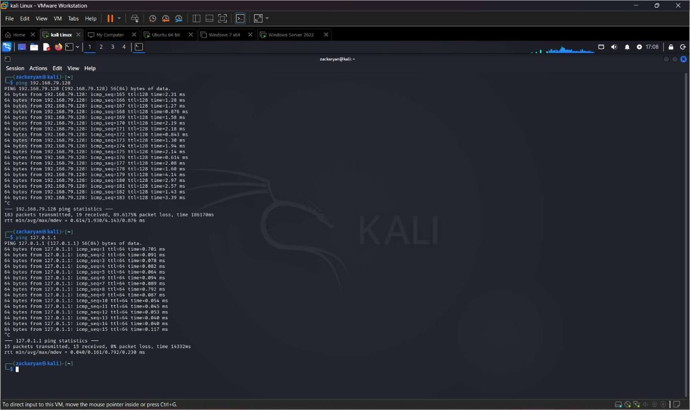
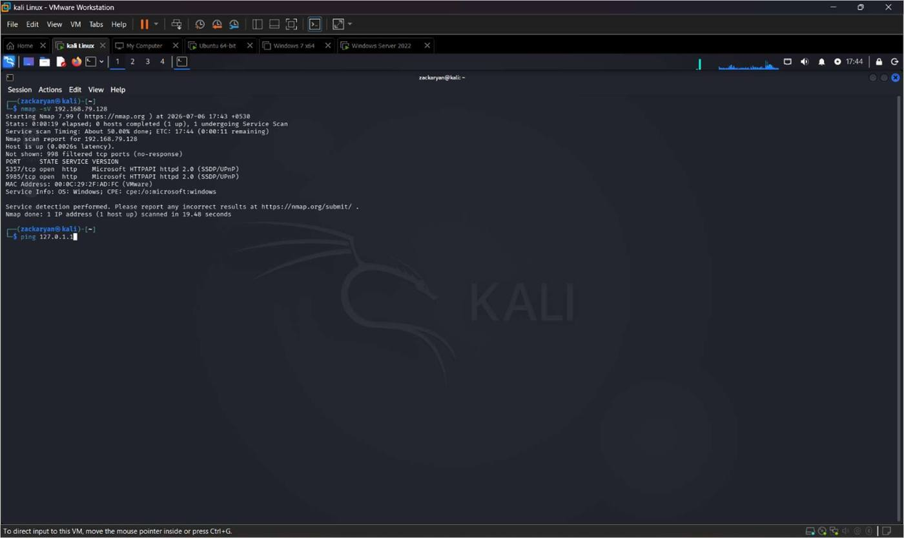
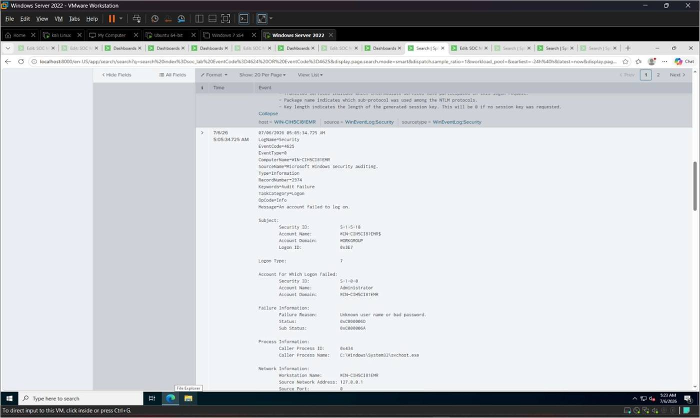
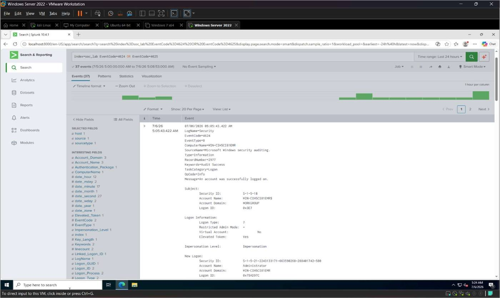
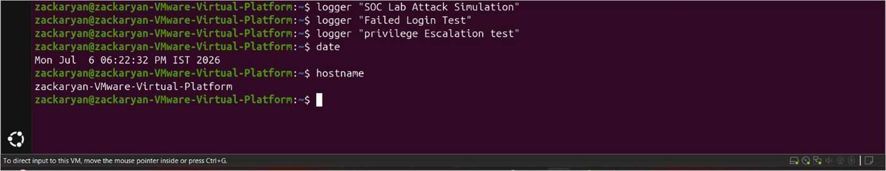
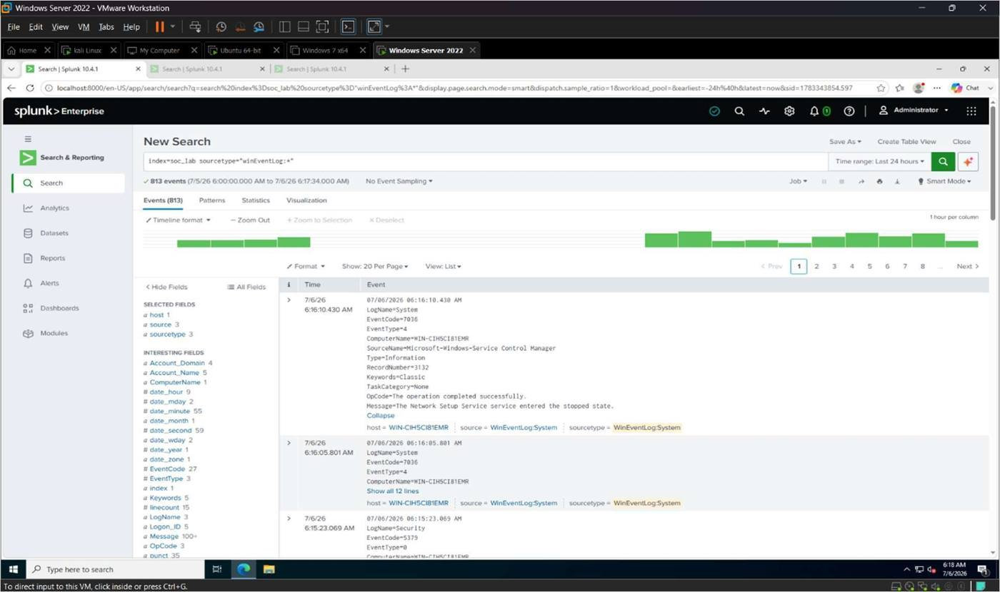
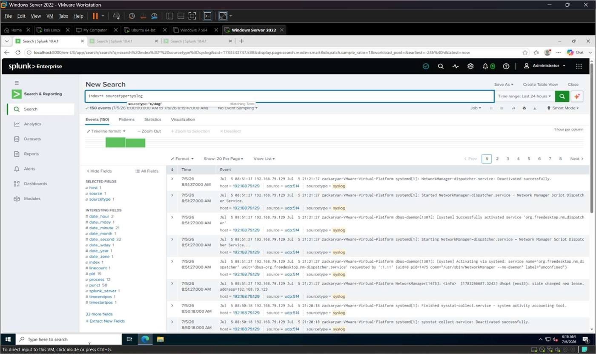
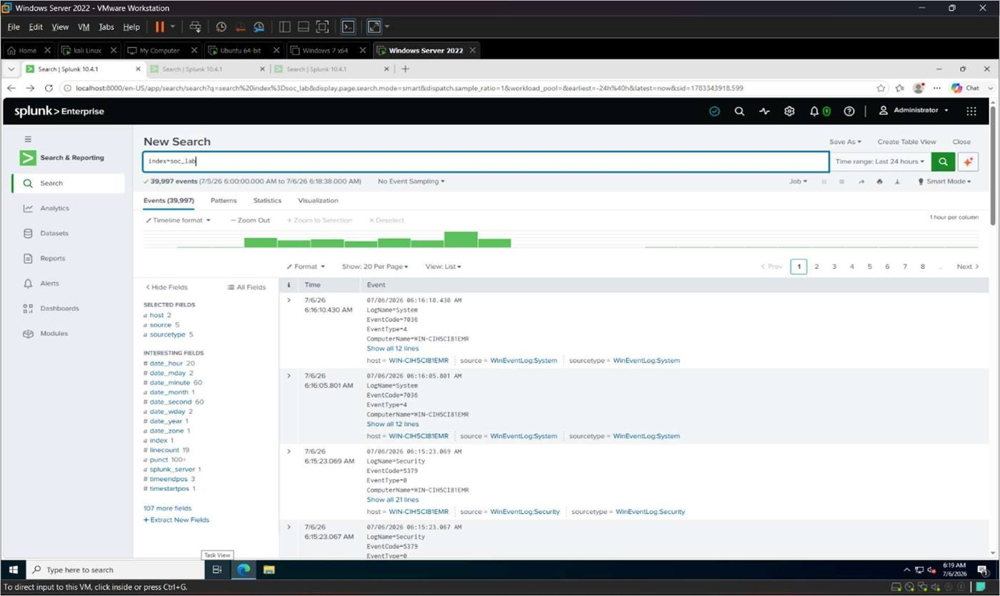

# 5. Attack Simulation

Attack simulation is an important phase in a SOC lab. It generates security events that can be
collected, monitored, and analyzed using a SIEM platform such as Splunk Enterprise. Controlled
attack simulations help verify log collection, evaluate detection capabilities, and improve
incident response procedures.

**Attacker machine:** Kali Linux
**Target machines:** Windows Server 2022, Ubuntu Linux

Different attack simulations were performed to generate Windows Event Logs, Linux Syslog
events, and network activity. The generated events were verified in Splunk using the `soc_lab`
index.

## Objectives

- Verify connectivity between Kali Linux and target machines.
- Generate security events using controlled attack simulations.
- Produce Windows and Linux logs.
- Verify attack events in Splunk.
- Prepare data for detection rule development.

## 5.1 Verify Network Connectivity

Connectivity between Kali Linux, Windows Server, and Ubuntu was verified before running any
simulation.

```bash
ping <Windows_Server_IP>
ping <Ubuntu_IP>
```

Successful replies confirmed that all virtual machines could communicate.


*Figure 5.1*

## 5.2 Perform Network Port Scan

A network port scan was performed from Kali Linux to identify open ports on the Windows Server.

```bash
nmap <Windows_Server_IP>
```

The scan displayed the open network ports and available services.


*Figure 5.2*

## 5.3 Perform Service Version Detection

Service version detection was used to identify the services running on the Windows Server.

```bash
nmap -sV <Windows_Server_IP>
```

The command displayed service names and version information.


*Figure 5.3*

## 5.4 Generate Windows Login Events

Several login attempts were performed on the Windows Server using valid and invalid
credentials to generate Windows Security Event Logs (successful and failed logins).


*Figure 5.4*


*Figure 5.5*


*Figure 5.6*

## 5.5 Generate Linux Authentication Events

Authentication events were generated on the Ubuntu virtual machine. Example activities
included:

- Logging into Ubuntu.
- Executing administrative commands using `sudo`.
- Running:

```bash
logger "SOC Lab Attack Simulation"
```

These activities produced Syslog events.


*Figure 5.7*

## 5.6 Verify Windows Events in Splunk

```spl
index=soc_lab sourcetype="WinEventLog:*"
```


*Figure 5.8*

## 5.7 Verify Linux Events in Splunk

```spl
index=soc_lab sourcetype=syslog
```


*Figure 5.9*

## 5.8 Verify All Generated Events

```spl
index=soc_lab
```


*Figure 5.10*

## Tasks Performed

- Verified communication between all virtual machines.
- Performed a network port scan using Nmap.
- Identified running network services.
- Generated Windows Security events.
- Generated Linux Syslog events.
- Verified Windows logs in Splunk.
- Verified Linux logs in Splunk.
- Verified all generated events in the `soc_lab` index.

## Summary

Controlled attack simulations were successfully performed using Kali Linux within the SOC lab
environment. Network connectivity was verified, port scanning activities were carried out, and
Windows and Linux security events were generated. The resulting logs were successfully
collected and verified in Splunk Enterprise. These events provide realistic security data used
to develop and test the detection rules in the next chapter.
