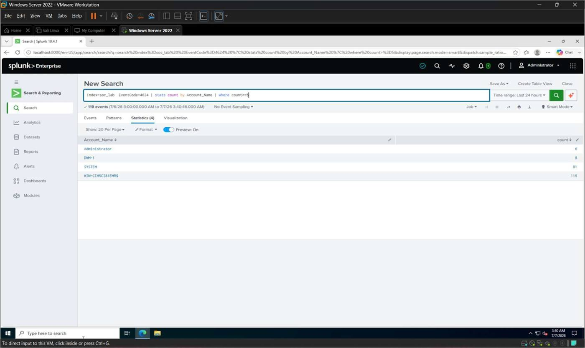
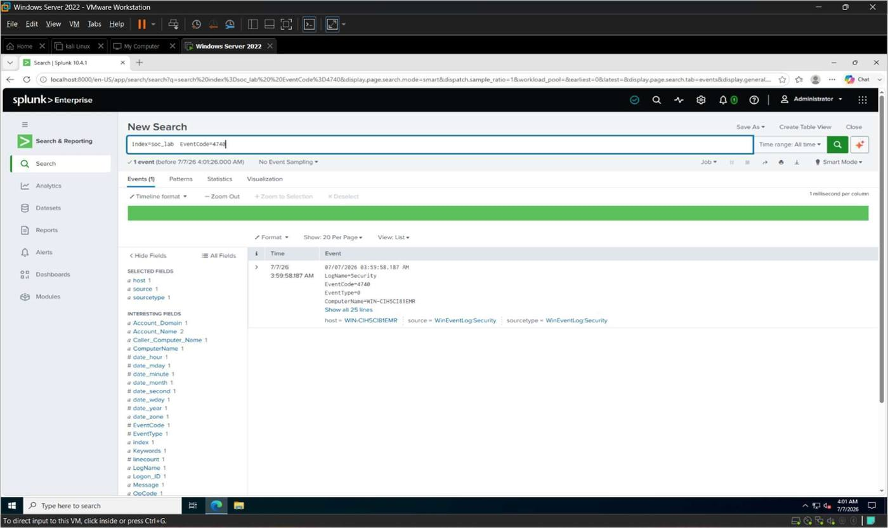
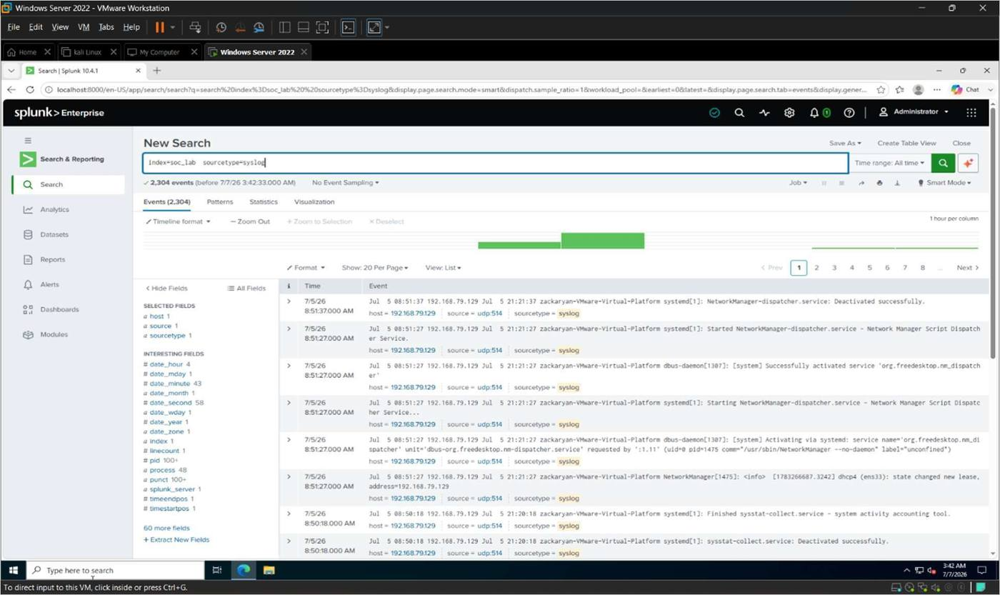
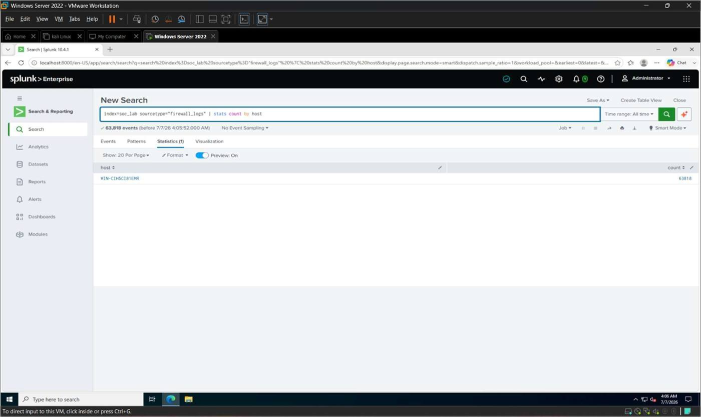
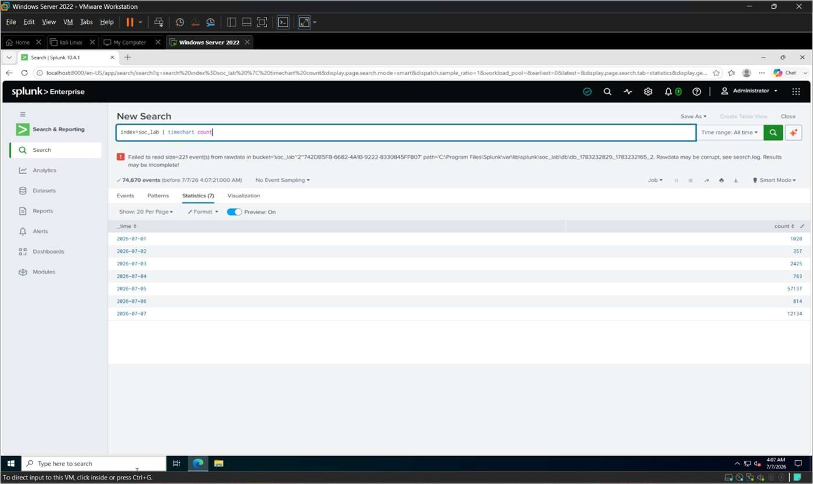

# 6. Detection Rules

Detection rules are one of the most important components of a Security Operations Center (SOC).
They enable analysts to identify suspicious activity by continuously monitoring security events
collected from different sources. In Splunk Enterprise, detection rules are built using Search
Processing Language (SPL) queries that search for specific event patterns, authentication
failures, and abnormal activity.

Detection rules in this project were developed using Windows Event Logs, Linux Syslog events,
and Firewall logs stored in the `soc_lab` index, and were designed to detect the security events
generated during the attack simulation phase.

## Objectives

- Create detection rules using SPL.
- Detect suspicious Windows activity.
- Detect Linux authentication events.
- Detect firewall-blocked connections.
- Verify detection rule results.

## Rule 1 — Windows Failed Login Detection

Identifies user accounts with five or more failed login attempts.

```spl
index=soc_lab EventCode=4625
| stats count by Account_Name
| where count>=5
```

| Account_Name | count |
|---|---|
| Administrator | 28 |
| WIN-CIH5CI81EMR | 28 |


*Figure 6.1*

## Rule 2 — Windows Successful Login Detection

Monitors and displays all successful Windows logins.

```spl
index=soc_lab EventCode=4624
| stats count by Account_Name
| where count>=5
```

| Account_Name | count |
|---|---|
| Administrator | 6 |
| DWM-1 | 4 |
| SYSTEM | 61 |
| WIN-CIH5CI81EMR | 110 |


*Figure 6.2*

## Rule 3 — Windows Account Lockout Detection

Identifies accounts that have been locked due to multiple failed login attempts.

```spl
index=soc_lab EventCode=4740
```


*Figure 6.3*

## Rule 4 — Linux Syslog Detection

Monitors Linux authentication and system events using Syslog.

```spl
index=soc_lab sourcetype=syslog
```

This rule displays all Linux Syslog events received from the Ubuntu server.


*Figure 6.4*

## Rule 5 — Firewall Log Detection

Analyzes firewall logs to identify blocked / allowed network traffic.

```spl
index=soc_lab sourcetype=firewall_logs
| stats count by host
```


*Figure 6.5*

## Rule 6 — Event Trend Detection

A time-based rule to monitor overall event activity across the environment.

```spl
index=soc_lab
| timechart count
```


*Figure 6.6*

## Rule 7 — Top Event Sources

Identifies the systems generating the highest number of logs.

```spl
index=soc_lab
| top host
```


*Figure 6.7*

## Rule 8 — Event Distribution by Sourcetype

Categorizes collected events according to their source type (Windows, Linux, Firewall).

```spl
index=soc_lab
| stats count by sourcetype
```

| sourcetype | count |
|---|---|
| WinEventLog:Application | 851 |
| WinEventLog:Security | 3788 |
| WinEventLog:System | 2575 |
| firewall_logs | 63982 |
| syslog | 2304 |


*Figure 6.8*

## Tasks Performed

- Created Windows failed login detection rules.
- Monitored successful Windows logins.
- Detected Windows account lockout events.
- Verified Linux Syslog events.
- Monitored firewall logs.
- Analyzed event trends over time.
- Identified top event sources.
- Classified logs based on source type.

## Summary

Multiple detection rules were created using Splunk Search Processing Language (SPL). The rules
successfully detected Windows authentication events, Linux Syslog activity, firewall events,
and overall security trends. These detection rules demonstrate how Splunk Enterprise can
identify suspicious activity in a SOC environment and support security monitoring and incident
detection.
