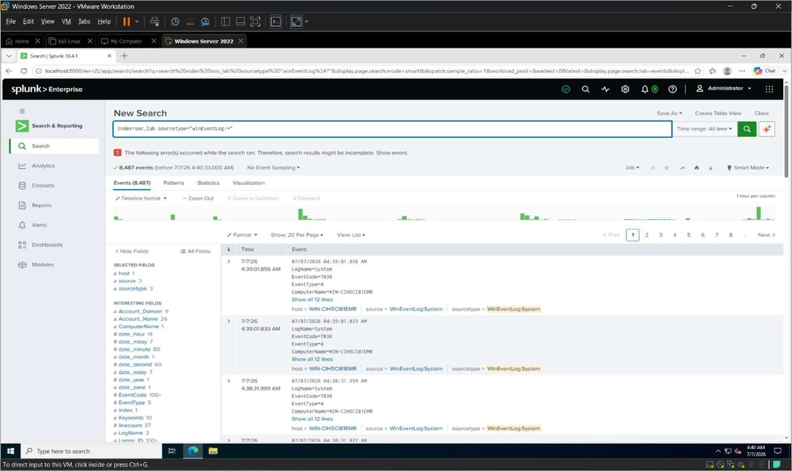
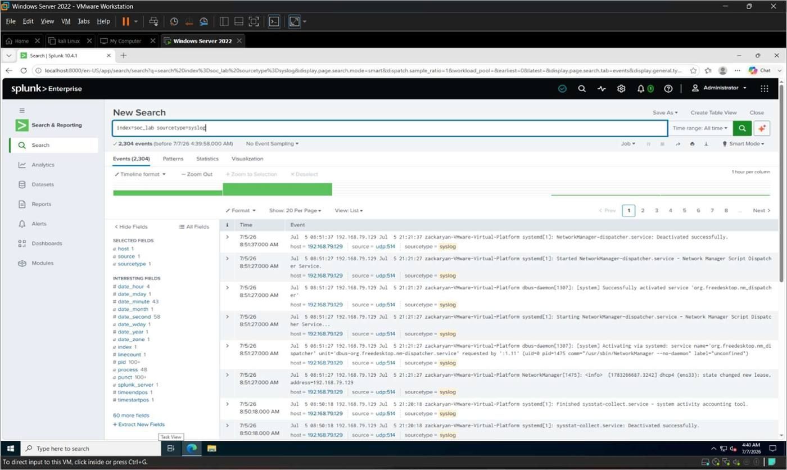
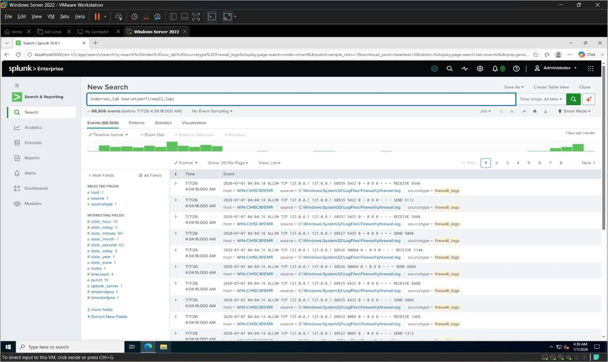

# 7. Results and Analysis

The objective of this project was to build a functional Security Operations Center (SOC)
monitoring environment using Splunk Enterprise. Windows Event Logs, Linux Syslog events, and
Firewall logs were collected from different virtual machines and stored in the `soc_lab`
index. Attack simulations were performed using Kali Linux to generate security events, which
were then monitored, analyzed, and visualized in Splunk.

This chapter presents the results obtained from the implemented SOC lab and evaluates the
effectiveness of the configured monitoring solution.

## Objectives

- Analyze the collected security events.
- Verify successful log collection.
- Evaluate attack simulation results.
- Review alert generation.
- Analyze dashboard visualizations.
- Summarize the overall SOC implementation.

## Result 1 — Windows Event Log Collection

Windows Event Logs were successfully collected from the Windows Server through the Splunk
Universal Forwarder. Security, System, and Application events were indexed successfully in the
`soc_lab` index.

```spl
index=soc_lab sourcetype="WinEventLog:*"
```

The search confirmed successful Windows log collection (8,487 events).


*Figure 7.1*

## Result 2 — Linux Syslog Collection

Ubuntu Linux successfully forwarded Syslog events to Splunk using the `rsyslog` service.
Authentication events, system messages, and manually generated logs were received
successfully.

```spl
index=soc_lab sourcetype=syslog
```

The received logs confirmed successful Syslog forwarding (2,304 events).


*Figure 7.2*

## Result 3 — Firewall Log Collection

Firewall events were successfully collected and stored in Splunk Enterprise.

```spl
index=soc_lab sourcetype=firewall_logs
```

The collected firewall events (66,506) verified successful log forwarding.


*Figure 7.3*

## Result 4 — Attack Simulation Analysis

Controlled attack simulations were performed from Kali Linux to generate security events. The
simulations included:

- Network connectivity testing
- Nmap port scanning
- Windows login activity
- Linux log generation

These activities successfully generated events that were indexed in Splunk Enterprise.

## Result 5 — Alert Analysis

Security alerts configured in Splunk successfully detected matching events generated during
testing. The alerts demonstrated that the monitoring environment was capable of identifying
suspicious activity automatically.

## Result 6 — Dashboard Analysis

Dashboard Studio successfully displayed security events using multiple visualizations. The
dashboard included:

- Total Event Count
- Windows Event Statistics
- Linux Event Timeline
- Firewall Activity
- Latest Security Events

The dashboard provided a centralized and real-time monitoring interface.

## Result 7 — Detection Rule Analysis

Detection rules successfully identified Windows authentication events, Linux Syslog activity,
and Firewall events using SPL queries, demonstrating how Splunk can automatically detect
security-related activity in a SOC environment.

## Overall Analysis

The implementation of Splunk Enterprise successfully centralized log collection from multiple
sources within the virtual SOC environment. Windows Server, Ubuntu Linux, and Firewall logs
were indexed in the `soc_lab` index and analyzed using SPL queries. Attack simulations generated
realistic security events that validated the effectiveness of log collection, detection rules,
alerts, and dashboard visualizations.

The project demonstrated that Splunk Enterprise can efficiently support log management, event
correlation, and security monitoring within a small-scale SOC lab.

## Key Findings

- Windows Event Logs were successfully collected.
- Ubuntu Syslog forwarding operated correctly.
- Firewall logs were indexed successfully.
- Attack simulations generated useful security events.
- Detection rules identified suspicious activities.
- Alerts triggered correctly when configured conditions were met.
- Dashboard Studio provided effective visualization of security data.

## Summary

The results obtained from this project confirmed that Splunk Enterprise successfully collected,
indexed, and analyzed security logs from multiple systems. Attack simulations validated the
functionality of the monitoring environment, while detection rules, alerts, and dashboards
provided effective visibility into security events. Overall, the implemented SOC lab achieved
the project objectives and demonstrated the practical application of SIEM technology for
centralized security monitoring.
